title: Data processing with Python
output: 2-data.html
style: style.css
theme: /home/as/wrk/seminar/cleaver-ribbon
github-theme: shoorick/cleaver-ribbon
author:
  name: "Alexander Sapozhnikov, Tatyana Vasilieva"
  github: shoorick
  company: "South Ural State University"
  twitter: "@shoorick77"
  url: "https://as.susu.ru"
-- title clear
## Data processing with Python
<figure>
    
    <figcaption class="copyright right white">
        © Mike Wesemann
    </figcaption>
</figure>
-- clear
<h2 class="shout shrink">Part 2</h2>
--
## Part 2

* Variables
* Objects
* Data types
--
## Documentation

* `help()`
--
## Navigate through help page

* <mark>Enter ↲</mark> or <mark>↓</mark> arrow — next line
* <mark>↑</mark> arrow — previous line
* <mark>space</mark> — next page
* <mark>g</mark> — scroll to top
* <mark>G</mark> — scroll to bottom
* <mark>q</mark> — quit from help
--
## Documentation

* `help()`
* [docs.python.org](https://docs.python.org)
* cheat.sh
  * [cheat.sh/python](http://cheat.sh/python) — how to run
    * [cheat.sh/python/:list](http://cheat.sh/python/:list) — list of pages
    * [cheat.sh/python/:learn](http://cheat.sh/python/:learn) — learn Python — comprehensive page
    * [cheat.sh/python/~keyword](http://cheat.sh/python/~keyword) — search in pages for <mark>keyword</mark>
--
## Interactive programming environments
* [repl.it](https://repl.it/)
* [pythonfiddle.com](http://pythonfiddle.com/)
-- black clear

-- black clear
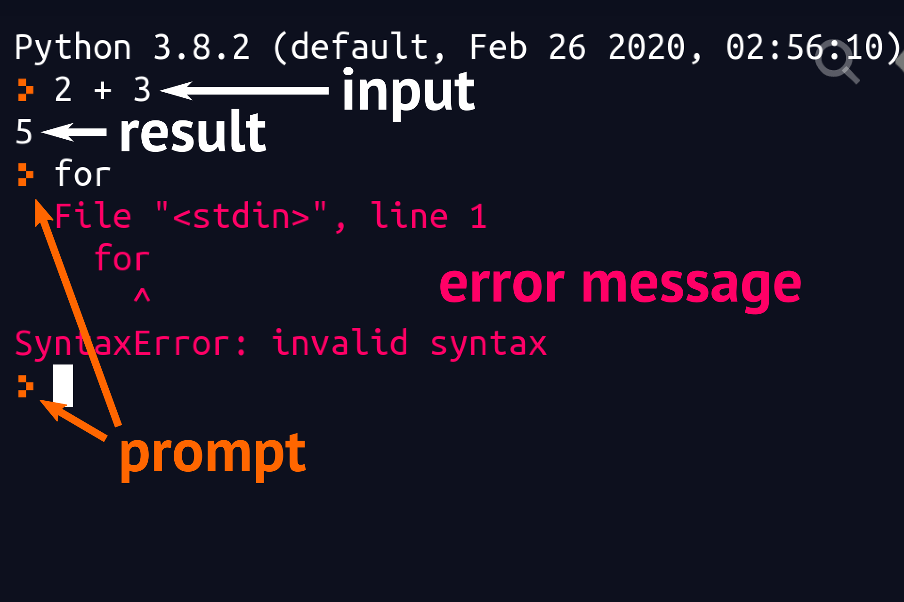
--
## Interactive mode
<pre>
<code><mark>&gt;&gt;&gt;</mark></code>
<code>⮬ prompt</code>
</pre>
--
## Interactive mode
<pre>
<code>&gt;&gt;&gt; <mark>42 + 24</mark></code>
<code>our input ⮭</code>
</pre>
--
## Interactive mode
<pre>
<code>&gt;&gt;&gt; 42 + 24</code>
<code><mark>66</mark> ⬅ result</code>
</pre>
--
## Oops
<pre>
<code>&gt;&gt;&gt; 42 + 'e'</code>
<code class="mark">Traceback (most recent call last):</code>
<code class="mark">  File "<stdin>", line 1, in &lt;module&gt;</code>
<code class="mark">TypeError: unsupported operand type(s) for +: 'int' and 'str'</code>
<code>⮬ error messages</code>
</pre>
--
## Syntax peculiarities

No semicolon <mark>;</mark> after single statement

```
counter = 42
```
--
## Syntax peculiarities

Colon and indent instead of curly braces for blocks

<pre>
<code>for fruit in basket<mark class="important">:</mark></code>
<code><mark>    </mark><span class="comment"># four spaces is recommended</span></code>
<code><mark>    </mark>print(fruit)</code>
</pre>
--
## Syntax peculiarities

Colon and indent instead of curly braces for blocks

<pre>
<code>for fruit in basket<mark>:</mark></code>
<code><mark class="important">    </mark><span class="comment"># four spaces is recommended</span></code>
<code><mark class="important">    </mark>print(fruit)</code>
</pre>
--
<h2 class="shout">Python is case sensitive</h2>
--
## Python is case sensitive

<pre style="font-size:600%;margin-top:.5em">
<code>A ≠ a</code>
</pre>
--
<h2 class="shout">Variables</h2>
--
## Variables

### Assignment

```
name = 'value'
```

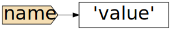
--
## Assign a new value

```
name = 'value'
name = 42
```

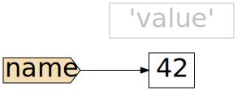

--
## Multiple assignment

<div class="columns two">
<div>

<pre>
<code>&gt;&gt;&gt; mice = cats = dogs = 3
&gt;&gt;&gt; cats
3
</code></pre>

</div><div>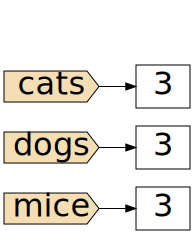</div>
</div>

--
## Multiple assignment

<div class="columns two">
<div>

<pre>
<code>&gt;&gt;&gt; mice = cats = dogs = 3
&gt;&gt;&gt; cats
3
&gt;&gt;&gt; cats = 15
&gt;&gt;&gt; dogs
3
</code></pre>

</div><div>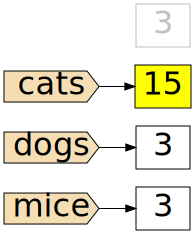</div>
</div>

--

## Variable naming

> There are only two hard things in Computer Science:<br>
> cache invalidation and naming things.<br><br>
> **Phil Karlton**

--

## Variable naming

Available characters are:

* Small and capital Latin letters **a** to **z** and **A** to **Z**
* Digits (not in first position)
* Underscore `_`

```
>>> theSun_and_8_planets = 'solar'
```
--
## Variable naming
<div class="columns two">
<p>
`b` (single lowercase letter)<br>
`B` (single uppercase letter)<br>
`CapitalizedWords`
<br>or `CamelCase` 🐪
</p>
<p>
`lowercase`
`lower_case_with_underscores`
`UPPERCASE`
`UPPER_CASE_WITH_UNDERSCORES`
<br><br>See [PEP8](https://www.python.org/dev/peps/pep-0008/#naming-conventions)
</p>
</div>
--
## Variable naming

Convention is to use <mark>lower_case_with_underscores</mark>
— 🐍 snake case

for variables and functions

* <del><code>theSun_and_8_planets</code></del>
* <code>the<mark>_s</mark>un_and_8_planets</code>

--
## You cannot use keyword as variable name

```
>>> global = 'World'
  File "<stdin>", line 1
    global = 'World'
           ^
SyntaxError: invalid syntax
```
--
## You cannot use keyword as variable name

<pre>
<code>&gt;&gt;&gt; help("keywords")

Here is a list of the Python keywords.  Enter any keyword to get more help.

False       class       from        or
None        continue   <mark> global </mark>     pass
True        def         if          raise
</code></pre>
--
## Keywords

<table class="striped">
<tr><td>False</td><td>None</td><td>True</td><td>and</td><td>as</td></tr>
<tr><td>assert</td><td>async</td><td>await</td><td>break</td><td>class</td></tr>
<tr><td>continue</td><td>def</td><td>del</td><td>elif</td><td>else</td></tr>
<tr><td>except</td><td>finally</td><td>for</td><td>from</td><td>global</td></tr>
<tr><td>if</td><td>import</td><td>in</td><td>is</td><td>lambda</td></tr>
<tr><td>nonlocal</td><td>not</td><td>or</td><td>pass</td><td>raise</td></tr>
<tr><td>return</td><td>try</td><td>while</td><td>with</td><td>yield</td></tr>
</table>
--

## Variable naming

Python 3 allows to use some non-ASCII letters but <mark>it’s a wrong way</mark>

```
>>> Öl = 'Barrel.'
>>> print(Öl * 3)
Barrel.Barrel.Barrel.
>>> Ø = 0
>>> Ж = 8
>>> Зима = 'Winter'
```
--

## Don’t do that

```
>>> ქ = 'khar'
>>> ձ = 'ja'
>>> ж = 'zhe'
>>> ξ = 'xi'
>>> ש = 'shin'
>>> ش = 'sheen'
```
--

## Don’t do that

```
>>> o = 'Latin'
>>> ο = 'Greek'
>>> о = 'Cyrillic'
>>> օ = 'Armenian'
>>> ჿ = 'Georgian'
>>> print(o, ο, о, օ, ჿ)
Latin Greek Cyrillic Armenian Georgian
```
--
## Non-letters are forbidden

```
>>> × = 'multiply'
  File "<stdin>", line 1
    × = 'multiply'
    ^
```
--
## Non-letters are forbidden

```
>>> ⼤ = 'big'
  File "<stdin>", line 1
    ⼤ = 'big'
    ^
SyntaxError: invalid character in identifier
```

--
## Process and output variable

```
>>> some = 'thing'
>>> len(some)
5
>>> print(some)
thing
```
--
## Process and output variable

```
>>> print(some)
thing
>>> print('Any' + some)
Anything

```

--
<h2 class="shout">Objects and classes</h2>
--
## Let's imagine some animal

<div class="columns four">
  <div class="next">
    <h3>Properties</h3>
    <ul>
      <li>Size</li>
      <li>Name</li>
      <li>Genus</li>
      <li>Color</li>
    </ul>
  </div>
  <div class="next">
    <h3>Actions</h3>
    <ul>
      <li>Eat</li>
      <li>Go</li>
      <li>Run</li>
      <li>Sleep</li>
    </ul>
  </div>
  <div class="next">
    <h3>`cat` is an Object</h3>
    <pre>
      <code>height = cat.size

result = cat.run(42)
is_relaxed = cat.sleep()
      </code>
    </pre>
  </div>
</div>

--
## Let's imagine some animal

<div class="columns four">
  <div>
    <h3>Properties</h3>
    <ul>
      <li>Size</li>
    </ul>
  </div>
  <div>
    <p>&nbsp;</p>
    <p>&nbsp;</p>
    <h3 style="margin-bottom:5px">Methods</h3>
    <ul>
      <li>Run</li>
      <li>Sleep</li>
    </ul>
  </div>
  <div>
    <h3>`cat` is an Object</h3>
    <pre>
      <code>height = cat.size

result = cat.run(42)
is_relaxed = cat.sleep()
      </code>
    </pre>
  </div>
</div>
--
## Object has properties

<div class="columns four">
  <div>
    <h3>Properties</h3>
    <ul>
      <li><mark>Size</mark></li>
    </ul>
  </div>
  <div>
    <p>&nbsp;</p>
    <p>&nbsp;</p>
    <h3 style="margin-bottom:5px">Methods</h3>
    <ul>
      <li>Run</li>
      <li>Sleep</li>
    </ul>
  </div>
  <div>
    <h3>`cat` is an Object</h3>
    <pre>
      <code>height = cat<mark>.size</mark>

result = cat.run(42)
is_relaxed = cat.sleep()
      </code>
    </pre>
  </div>
</div>

--
## Object has methods

<div class="columns four">
  <div>
    <h3>Properties</h3>
    <ul>
      <li>Size</li>
    </ul>
  </div>
  <div>
    <p>&nbsp;</p>
    <p>&nbsp;</p>
    <h3 style="margin-bottom:5px">Methods</h3>
    <ul>
      <li><mark>Run</mark></li>
      <li><mark>Sleep</mark></li>
    </ul>
  </div>
  <div>
    <h3>`cat` is an Object</h3>
    <pre>
      <code>height = cat.size

result = cat<mark>.run(42)</mark>
is_relaxed = cat<mark>.sleep()</mark>
      </code>
    </pre>
  </div>
</div>
--
## Use dot <mark class="orange">.</mark> to call properties and methods

<div class="columns four">
  <div>
    <h3>Properties</h3>
    <ul>
      <li>Size</li>
    </ul>
  </div>
  <div>
    <p>&nbsp;</p>
    <p>&nbsp;</p>
    <h3 style="margin-bottom:5px">Methods</h3>
    <ul>
      <li>Run</li>
      <li>Sleep</li>
    </ul>
  </div>
  <div>
    <h3>`cat` is an Object</h3>
    <pre>
      <code>height = cat<mark class="orange">.</mark>size

result = cat<mark class="orange">.</mark>run<mark class="green">(42)</mark>
is_relaxed = cat<mark class="orange">.</mark>sleep<mark class="green">()</mark>
      </code>
    </pre>
  </div>
</div>
--
## Class vs Object

<div class="columns three">
  <div>
    <p>**Class →**</p>
    <p>&nbsp;</p>
    <p>&nbsp;</p>
    <p>**Objects →**</p>
  </div>
  <div><pre><code>class Animal:
    def \__init__(self, name):
        self.name = name

cat   = Animal('Tom')
mouse = Animal('Jerry')</code></pre>
  </div>
</div>
--
## Which reason?

### Any data type is a <mark>Class</mark>
* `int`, `float`, `str`, `list`, `tuple`, `dict`, `range`...

### Any data is an <mark>Object</mark>
* `42`, `3.14159265358`, `'something'`, `[2, 12, 85, 0.6]`...
--
<h2 class="shout">Data types</h2>
--
## Built-in data types

* bool
* int, float, complex
* list, tuple, dict, set, range
* str

See also [docs.python.org/3.7/library/stdtypes](https://docs.python.org/3.7/library/stdtypes.html)
--
## Built-in data types

* __bool__ean — _logical_
* __int__eger, __float__, __complex__ — _numeric_
* __list__, __tuple__, __dict__ionary, __set__, __range__ — _sequences and structures_
* __str__ing — _chain of characters_

See also [docs.python.org/3.7/library/stdtypes](https://docs.python.org/3.7/library/stdtypes.html)
--
## Detect <mark>type</mark> of data

<pre>
<code class="mark">&gt;&gt;&gt; type(42)</code>
<code>&lt;class 'int'&gt;</code>
</pre>
--
## Detect type of data

<pre>
<code>&gt;&gt;&gt; type(42)</code>
<code>&lt;class 'int'&gt;</code>
<code class="mark">&gt;&gt;&gt; type(3.14)</code>
<code>&lt;class 'float'&gt;</code>
</pre>
--
## Detect type of data

<pre>
<code>&gt;&gt;&gt; type(42)</code>
<code>&lt;class 'int'&gt;</code>
<code>&gt;&gt;&gt; type(3.14)</code>
<code>&lt;class 'float'&gt;</code>
<code class="mark">&gt;&gt;&gt; type('3.14')</code>
<code>&lt;class 'str'&gt;</code>
</pre>
--
## Detect type of <mark>variables</mark> and <mark class="green">expressions</mark>

<pre>
<code>&gt;&gt;&gt; type(<mark>some</mark>)    <span class="comment"># variable</span></code>
<code>&lt;class 'str'&gt;</code>
<code>&gt;&gt;&gt; type(<mark class="green">5 + 0.5</mark>) <span class="comment"># expression</span></code>
<code>&lt;class 'float'&gt;</code>
</pre>
--
## List methods with <mark>dir</mark>

<pre>
<code>&gt;&gt;&gt; some = 'Thing'
&gt;&gt;&gt; <mark>dir</mark>(some)     <span class="comment"># or</span>
&gt;&gt;&gt; <mark>dir</mark>('Thing')  <span class="comment"># or</span>
&gt;&gt;&gt; <mark>dir</mark>(str)
['__add__', '__class__', '__contains__', '__delattr__', '__dir__',
... 'swapcase', 'title', 'translate', 'upper', 'zfill']
</code></pre>

--
## List methods with dir()

<pre>
<code>&gt;&gt;&gt; some = 'Thing'
&gt;&gt;&gt; dir(some)
['__add__', '__class__', '__contains__', '__delattr__', '__dir__',
... <mark>'swapcase'</mark>, 'title', 'translate', 'upper', 'zfill']
&gt;&gt;&gt; some<mark>.swapcase()</mark>
'tHING'
</code></pre>
--
## bool

**Bool**ean type is used for logical data

* **T**rue
* **F**alse

Note: the capitalization

--
## Logic

Answers have <mark>bool</mark>ean type

```
>>> type(5 < 2)
<class 'bool'>
>>> type(apple == 'fruit')
<class 'bool'>
```

--
## Convert to boolean

```
>>> bool(7)
True
>>> bool('non empty')
True
>>> bool([2020, 11, 22])
True
```
--
## Convert to boolean

```
>>> bool(0)
False
>>> bool('')
False
>>> bool([])
False
```

--
## Implicit conversion to boolean

<pre>
<code>&gt;&gt;&gt; if <mark>list_name</mark>:
...    <span class="comment"># do something with list_name</span>
</code></pre>

--
## False value testing

* constants defined to be false: `None` and `False`.
* zero of any numeric type: `0`, `0.0`, `0j`, `Decimal(0)`, `Fraction(0, 1)`
* empty sequences and collections: `''`, `()`, `[]`, `{}`, `set()`, `range(0)`

--
## int

integer number

```
>>> type(42)
<class 'int'>
```
--
## Underscores for long numbers

<pre>
<code class="next">&gt;&gt;&gt; 4_294_967_296     <span class="comment"># 2<sup>32</sup></span></code>
<code class="next">4294967296</code>
<code class="next">&gt;&gt;&gt; +7_800_775_00_00  <span class="comment"># even phone numbers</span></code>
<code class="next">78007750000</code>
</pre>
--
## int can use various bases

<pre>
<code class="next">&gt;&gt;&gt; 0xC0FFEE  <span class="comment"># hexadecimal</span></code>
<code class="next">12648430</code>
<code class="next">&gt;&gt;&gt; 0o777     <span class="comment"># octal</span></code>
<code class="next">511</code>
<code class="next">&gt;&gt;&gt; 0b1111    <span class="comment"># binary</span></code>
<code class="next">15</code>
</pre>
--
## float

Floating point number

<pre>
<code class="next">&gt;&gt;&gt; 3.1415926</code>
<code class="next">3.1415926</code>
<code class="next">&gt;&gt;&gt; 9.</code>
<code class="next">9.0</code>
<code class="next">&gt;&gt;&gt; 3e8</code>
<code class="next">300000000.0</code>
</pre>
--
## float

`3e8` = 3 × 10<sup>8</sup> = 300000000.0 <em class="comment"># light speed, meters per second</em>

`125e-3` = 125 × 10<sup>−3</sup> = 0.125

<pre>
<code class="next">&gt;&gt;&gt; 6.022e23 <span class="comment"># Avogadro constant, mol<sup>−1</sup></span></code>
<code class="next">6.022e+23</code>
</pre>

--
## Change type

Use name of type as function to convert data

<pre>
<code class="next">&gt;&gt;&gt; <mark class="orange">int</mark>(3.1415926)</code>
<code class="next">3</code>
<code class="next">&gt;&gt;&gt; <mark class="green">float</mark>(42)</code>
<code class="next">42.0</code>
</pre>

--
## Implicit type changing

<pre>
<code class="next">&gt;&gt;&gt; 3. + 2</code>
<code class="next">5.0</code>
<code class="next">&gt;&gt;&gt; 3 + 2.</code>
<code class="next">5.0</code>
</pre>
--
## str

__string__ is the sequence of characters

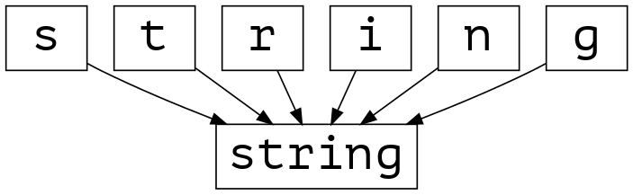
--
## Individual characters are accessible

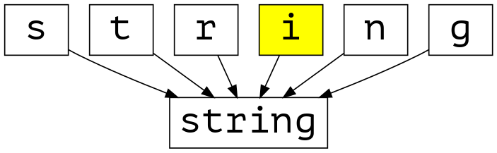

```
>>> 'string'[3]
'i'
```
--
## as well as whole string

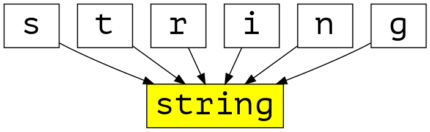

```
>>> 'string'.upper()
'STRING'
```
--
## String parts are strings too


```
>>> 'string'[3].upper()
'I'
```
--
## Methods of `str`
<div class="two columns">
  <div>
    <ul>
      <li>**capitalize**() → string</li>
      <li>**center**(width[, fillchar]) → string</li>
      <li>**count**(sub[, start[, end]]) → int</li>
      <li>**decode**([encoding[,errors]]) → object</li>
      <li>**encode**([encoding[,errors]]) → object</li>
    </ul>
  </div>
  <div>
    <ul>
      <li>**endswith**(suffix[, start[, end]]) → bool</li>
      <li>**expandtabs**([tabsize]) → string</li>
      <li>**find**(sub [,start [,end]]) → int</li>
      <li>**format**(\*args, \**kwargs) → string</li>
      <li>**index**(sub [,start [,end]]) → int</li>
    </ul>
  </div>
</div>
--
## Methods of `str`
<div class="two columns">
  <div>
    <ul>
      <li>**isalnum**() → bool</li>
      <li>**isalpha**() → bool</li>
      <li>**isdigit**() → bool</li>
      <li>**islower**() → bool</li>
      <li>**isspace**() → bool</li>
      <li>**istitle**() → bool</li>
      <li>**isupper**() → bool</li>
    </ul>
  </div>
  <div>
    <ul>
      <li>**join**(iterable) → string</li>
      <li>**just**(width[, fillchar]) → string</li>
      <li>**lower**() → string</li>
      <li>**lstrip**([chars]) → string or unicode</li>
      <li>**partition**(sep) → (head, sep, tail)</li>
      <li>**replace**(old, new[, count]) → string</li>
      <li>**rfind**(sub [,start [,end]]) → int</li>
    </ul>
  </div>
</div>
--
## Methods of `str`
<div class="two columns">
  <div>
    <ul>
      <li>**rindex**(sub [,start [,end]]) → int</li>
      <li>**rjust**(width[, fillchar]) → string</li>
      <li>**rpartition**(sep) → (head, sep, tail)</li>
      <li>**rsplit**([sep [,maxsplit]]) → list of strings</li>
      <li>**rstrip**([chars]) → string or unicode</li>
    </ul>
  </div>
  <div>
    <ul>
      <li>**split**([sep [,maxsplit]]) → list of strings</li>
      <li>**splitlines**(keepends=False) → list of strings</li>
      <li>**startswith**(prefix[, start[, end]]) → bool</li>
      <li>**strip**([chars]) → string or unicode</li>
    </ul>
  </div>
</div>
--
## Methods of `str`
<div class="two columns">
  <div>
    <ul>
      <li>**swapcase**() → string</li>
      <li>**title**() → string</li>
      <li>**translate**(table [,deletechars]) → string</li>
      <li>**upper**() → string</li>
      <li>**zfill**(width) → string
    </ul>
  </div>
  <div>
    <h3 style="font-size:2em">38 methods!</h3>
  </div>
</div>
--
## String subtypes

```
>>> 'Generic' or "common"
'Generic'
```
--
## Special characters

```
>>> 'B letter \x42'
'B letter B'
>>> "\x53ame behavior with double quotation marks"
'Same behavior with double quotation marks'
>>> 'Unicode: питон — это змея 🐍 蛇'
'Unicode: питон — это змея 🐍 蛇'
```
--
## Special characters

C-like notation

* <code>\n</code> — new line (LF — line feed)
* <code>\r</code> — carriage return (CR)
* <code>\xNN</code> — character having hexadecimal ASCII code <var>NN</var>

---
## Use """triple delimiters""" to make multiple lines

```
>>> """
... Multiline strings
... often used as comments
... """
'\nMultiline strings\noften used as comments\n'
```
---
## '''Triple delimiters'''

```
>>> '''
... These strings can contain
... 'single' or "double" quotation marks
... '''
'\nThese strings can contain\n\'single\' or "double" quotation marks\n'
```
--
## Special characters

C-like notation

* <code>\n</code> — new line (LF — line feed)
* <code>\r</code> — carriage return (CR)
* <code>\xNN</code> — character having hexadecimal ASCII code <var>NN</var>

```
>>> '\xAB'
'«'
```
--
## Special characters

What about small Russian letter “ef”? Its hexadecimal code is 444.

```
>>> '\x444'
'D4'
```
--
## Special characters

What about small Russian letter “ef”? Its hexadecimal code is 444.

<pre>
<code>&gt;&gt;&gt; '<mark>\x44</mark>4'</code>
<code>'D4'</code>
</pre>
--
## Unicode characters
```
>>> '\u444'
  File "<stdin>", line 1
SyntaxError: (unicode error) 'unicodeescape' codec can't decode bytes in position 0-4: truncated \uXXXX escape
>>> '\u0444'
'ф'
>>> '\x01f41b'
'ὁb'
```
--
## Unicode characters above U+FFFF
```
>>> '\U1f41b'
  File "<stdin>", line 1
SyntaxError: (unicode error) 'unicodeescape' codec can't decode bytes in position 0-6: truncated \UXXXXXXXX escape
>>> '\U0001f41b'
'🐛'
```
--
## Unicode strings — u''

* <mark>Same as generic string — Python 3</mark>
* Different subtype — Python 2

```
>>> u'日'
'日'

```
--
## Byte strings — b''

* <mark>ASCII only — Python 3</mark>
* Same as generic string which treats as byte sequence — Python 2

```
>>> b'Byte'
b'Byte'
>>> b'Жи-ши'
  File "<stdin>", line 1
SyntaxError: bytes can only contain ASCII literal characters.
```
--
## Escape backslash

Just double it

```
>>> print('\\back')
\back
```

--
## Raw strings — r''

There are no special characters

```
>>> r'\back\slash'
'\\back\\slash'
```
--
## Raw strings

There are no special characters

```
>>> r'\back\slash'
'\\back\\slash'
>>> r'^\S+ome\regular\expr\e\s\Sio\n{7}'
'^\\S+ome\\regular\\expr\\e\\s\\Sio\\n{7}'
```

See also [re — Regular expression operations](https://docs.python.org/3.7/library/re.html)

--
## Raw strings

There are no special characters

```
>>> r'\back\slash'
'\\back\\slash'
>>> r'^\S+ome\regular\expr\e\s\Sio\n{7}'
'^\\S+ome\\regular\\expr\\e\\s\\Sio\\n{7}'
>>> r'C:\Windows\system32\drivers\hosts.txt'
'C:\\Windows\\system32\\drivers\\hosts.txt'
```
--
## Raw strings with triple delimiters

```
>>> r'''
... TenorI = \context Voice = TenorI {
...     \global
...     \dynamicUp \stemUp \slurUp \tieUp
...     \tempo Moderato
... '''
'\nTenorI = \\context Voice = TenorI {\n    \\global\n    \\dynamicUp \\stemUp \\slurUp \\tieUp\n    \\tempo Moderato\n'
```
-- clear

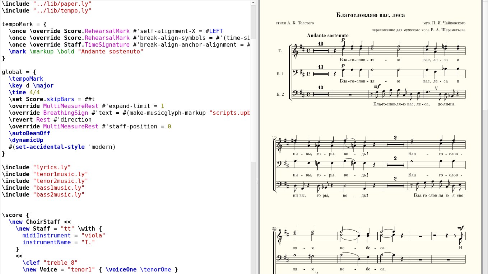

--
## Format strings — f''

```
>>> pi = 3.14159265358
>>> f'π is {pi}'
'π is 3.14159265358'
```

Since 2015 — Python 3.6. See also [realpython.com/python-f-strings](https://realpython.com/python-f-strings/)
--
## Concatenate strings with +

```
>>> 'head ' + 'and' + ' tail'
'head and tail'
```
--
## Concatenate strings with +
```
>>> 3 + ' is three'
Traceback (most recent call last):
  File "<stdin>", line 1, in <module>
TypeError: unsupported operand type(s) for +: 'int' and 'str'
>>> str(3) + ' is three'
'3 is three'
```
--
## list

**List** is a sequence of values

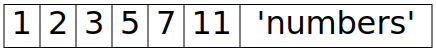

--
## list

List items can have various types


```
>>> [1, 2, 3, 5, 7, 11, 'numbers']
```
--
## Empty list

```
>>> empty = []
```
--
## List items numbered from 0

Index of item is an **offset** from left edge of list

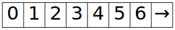

```
>>> prime_numbers = [1, 2, 3, 5, 7, 11]
```
--
## List items numbered from 0

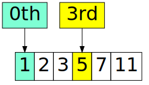

```
>>> prime_numbers = [1, 2, 3, 5, 7, 11]
>>> prime_numbers[3]
5
```

--
## Use negative indices to access last items

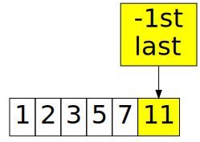

```
>>> prime_numbers[-1]
11
```

--
## Use negative indices to access last items

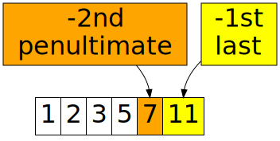

```
>>> prime_numbers[-2]
7
```
--
## Slice — `first:last`

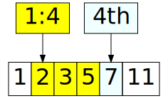

```
>>> prime_numbers[1:4]
[2, 3, 5]
```
--
## Slice — `first:` without right bound

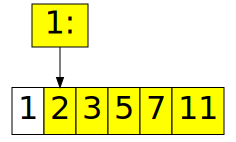

```
>>> prime_numbers[1:]
[2, 3, 5, 7, 11]
```

--
## Slice — `:last` without left bound

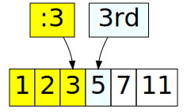

```
>>> prime_numbers[:3]
[1, 2, 3]
```

--
## Slice — `::step` after second semicolon

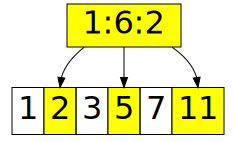

```
>>> prime_numbers[1:6:2]
[2, 5, 11]
```
--
## Without bounds but with `::step`

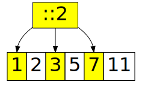

```
>>> prime_numbers[::2]
[1, 3, 7]
```
--
## Assign new value to certain item

```
>>> prime_numbers[3] = 'R'
>>> prime_numbers
[1, 2, 3, 'R', 7, 11]
```
--
## String parts are accessible same way

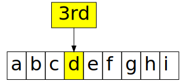

```
>>> line = 'abcdefghi'
>>> line[3]
'd'
```
--
## Get substring

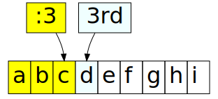

```
>>> line = 'abcdefghi'
>>> line[:3]
'abc'
```
--
## String parts are accessible same way

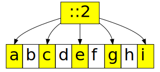

```
>>> line = 'abcdefghi'
>>> line[::2]
'acegi'
```
--
## Access to single character

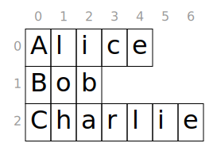

```
>>> names = ['Alice', 'Bob', 'Charlie']
```
--
## Access to single character

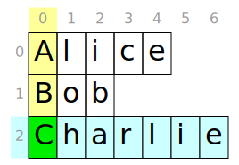

```
>>> names[2][0]
'C'
```
--
## Methods of `list`

```
>>> help(list)
Help on class list in module __builtin__:
...
 |  append(...)
 |      L.append(object) -- append object to end
 |
 |  count(...)
```
--
## Methods of `list`
<div class="two columns">
  <div>
    <ul>
      <li>**append**(object)</li>
      <li>**count**(value) → integer</li>
      <li>**extend**(iterable)</li>
      <li>**index**(value, [start, [stop]]) → integer</li>
    </ul>
  </div>
  <div>
    <ul>
      <li>**insert**(index, object)</li>
      <li>**pop**([index]) → item</li>
      <li>**remove**(value)</li>
      <li>**reverse**()</li>
      <li>**sort**(cmp=None, key=None, reverse=False)</li>
    </ul>
  </div>
</div>
--
## Methods of `list`

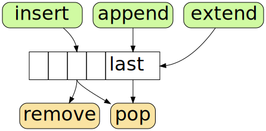
--
## <mark class="green">Add</mark> items to `list`
<pre>
<code>&gt;&gt;&gt; abc = ['a', 'b', 'c']
&gt;&gt;&gt; abc.<mark class="green">append</mark>('e')
&gt;&gt;&gt; abc.<mark class="green">extend</mark>(['f', 'g'])
&gt;&gt;&gt; abc.<mark class="green">insert</mark>(3, 'd')
&gt;&gt;&gt; abc
['a', 'b', 'c', 'd', 'e', 'f', 'g']
</code></pre>
--
## <mark class="orange">Remove</mark> items from `list`
<pre>
<code>&gt;&gt;&gt; abc = ['a', 'b', 'c', 'd', 'e', 'f', 'g']
&gt;&gt;&gt; abc.<mark class="orange">pop</mark>(3) <span class="comment"># return deleted item</span>
'd'
&gt;&gt;&gt; <mark class="orange">del</mark> abc[1] <span class="comment"># return nothing</span>
&gt;&gt;&gt; abc.<mark class="orange">remove</mark>('e')
&gt;&gt;&gt; abc
['a', 'c', 'f', 'g']
</code></pre>
---
## tuple

**Tuple** is read-only list

```
>>> (1, 2, 3, 5, 7, 11)
(1, 2, 3, 5, 7, 11)
>>> (1, 2, 3, 5, 7, 11)[3]
5
```
--
## Tuple is read-only list

```
>>> wheels = (2, 3, 4, 6, 8)
>>> wheels[2] = 7
Traceback (most recent call last):
  File "<stdin>", line 1, in <module>
TypeError: 'tuple' object does not support item assignment
```

--
## Make tuple

Use parentheses to make a tuple

```
>>> (2)
2        # oops! It's an integer
>>> (2,)
(2,)     # tuple has one item
>>> ()
()       # tuple is empty
```

--
## Convert tuple to list to make it writable

```
>>> list((1, 2, 3, 5, 7, 11))
[1, 2, 3, 5, 7, 11]
>>> tuple([1, 2, 3, 5, 7, 11])
(1, 2, 3, 5, 7, 11)
```

--
## dict

**Dict**ionary is list of pairs `key: value`

```
>>> apple = {'color': 'red', 'weight': 7, 'shape': 'ball'}
>>> apple['color']
'red'
>>> apple['shape']
'ball'
```

--
## Change values and add new ones

```
>>> apple['color'] = 'yellow'
>>> apple['origin'] = 'Normandy'
>>> f"{apple['color']} apple came from {apple['origin']}"
'yellow apple came from Normandy'
```

--
## Make an empty dict

<pre>
<code>&gt;&gt;&gt; empty = dict()  <span class="comment"># possible but ugly</span>
&gt;&gt;&gt; empty
{}

&gt;&gt;&gt; hollow = {}     <span class="comment"># better</span>
</code></pre>
--
## set

```
>>> even = {0, 2, 4, 6, 2, 0, 0}
>>> even
{0, 2, 4, 6}
```

--
## set

```
>>> 5 in even
False
>>> 2 in even
True
```
--
## Methods of set

```
>>> dir(set)
['__and__', '__class__', '__contains__', '__delattr__', '__dir__',
'add', 'clear', 'copy', 'difference', 'difference_update',
'discard', 'intersection', 'intersection_update', 'isdisjoint',
'issubset', 'issuperset', 'pop', 'remove', 'symmetric_difference',
'symmetric_difference_update', 'union', 'update']
```
[docs.python.org / Built-in Types #set](https://docs.python.org/3.7/library/stdtypes.html#set)
--
## Methods of set

```
>>> help(set)
 |  add(...)
 |      Add an element to a set.
 |      This has no effect if the element is already present.
 |
 |  clear(...)
 |      Remove all elements from this set.

```
[docs.python.org / Built-in Types #set](https://docs.python.org/3.7/library/stdtypes.html#set)
--
## Call some methods of set type

```
>>> threes = {3, 6, 9, 12, 15, 18}
>>> fives  = {5, 10, 15, 20 }
>>> threes.union(fives)
{3, 5, 6, 9, 10, 12, 15, 18, 20}
>>> threes.difference(fives)
{3, 6, 9, 12, 18}
```
--
## Convert range to set

<pre>
<code>&gt;&gt;&gt; threes = <mark>set(range(3, 21, 3))</mark>
&gt;&gt;&gt; fives  = <mark>set(range(5, 25, 5))</mark>
&gt;&gt;&gt; threes.union(fives)
{3, 5, 6, 9, 10, 12, 15, 18, 20}
&gt;&gt;&gt; threes.difference(fives)
{3, 6, 9, 12, 18}
</code></pre>
--
## Convert set to list
```
>>> threes[2]
Traceback (most recent call last):
  File "<stdin>", line 1, in <module>
TypeError: 'set' object is not subscriptable
>>> list(threes)[2]
9
```
--
## range

**Range** is the sequence of monotonically uniformly changing integers —
_arithmetic progression:_

* 4, 5, 6, 7, 8, ...
* 10, 9, 8, 7, 6, 5, 4, 3, 2, 1
* 5, 15, 25, 35

--
## Range

```
>>> teen = range(13, 20)
```

Mathematically, <var>t</var> = [13, 20)
--
## Range

```
>>> teen = range(13, 20)
```

Mathematically, <var>t</var> = <mark class="green">[</mark>13, 20<mark class="orange">)</mark>

<mark class="green">include</mark> 13 and <mark class="orange">exclude</mark> 20
--
## Print range

```
>>> teen = range(13, 20)
>>> teen
range(13, 20)
```

--
## Print range

```
>>> teen = range(13, 20)
>>> teen
range(13, 20)
>>> for age in teen: print(age, end=', ')
...
13, 14, 15, 16, 17, 18, 19,
```
--
## Get arbitrary item from range by its index

<pre>
<code>&gt;&gt;&gt; for age in teen: print(age, end=', ')
...
13, 14, 15, <mark>16</mark>, 17, 18, 19,
&gt;&gt;&gt; teen[3]
<mark>16</mark>
</code></pre>
--
## Get part of range

<pre>
<code>&gt;&gt;&gt; for age in teen: print(age, end=', ')
...
13, 14, 15, <mark>16</mark>, 17, 18, 19,
&gt;&gt;&gt; teen[3:]
range(<mark>16</mark>, 20)
&gt;&gt;&gt; teen[:3]
range(13, <mark>16</mark>)
</code></pre>
--
## Get part of range with third parameter

<pre>
<code>&gt;&gt;&gt; for age in teen: print(age, end=', ')
...
13, 14, 15, <mark>16</mark>, 17, 18, 19,
&gt;&gt;&gt; teen[3::2]
range(<mark>16</mark>, 20, <mark class="important">2</mark>)
</code></pre>
--
## Range with step

<pre>
<code>&gt;&gt;&gt; for item in range(0, 100, <mark class="important">9</mark>):
...     print(item, end=', ')
...
0, 9, 18, 27, 36, 45, 54, 63, 72, 81, 90, 99,
</code></pre>
--
## Range with negative step

```
>>> for item in range(3, 0, -1):
...     print(item, end=', ')
...
3, 2, 1,
```
--
## Range with negative step

```
>>> for item in range(3, 0, -1):
...     print(item, end=', ')
...
3, 2, 1,
```

<div class="spotlight" style="
    --spotlight-radius: 50%;
    --spotlight-opacity: 0.2;
    --spotlight-size: 256px;
    --spotlight-top: 50px;
    --spotlight-left: -256px;
"></div>

### No zero here
--
## Convert range to list

```
>>> before_ten = list(range(0, 10))
>>> before_ten
[0, 1, 2, 3, 4, 5, 6, 7, 8, 9]
```
--
## Conclusion

<ul>
  <li class="next">Data stored in variables.</li>
  <li class="next">Use proper names for variables.</li>
  <li class="next">All variables are objects, all data types are classes.</li>
  <li class="next">Python has a lot of built-in and external data types.</li>
  <li class="next">There ara implicit and explicit changes of data types.</li>
</ul>
--
## Next part
<h3><a href="3-flow.html">Part 3. Control flow and loops</a></h3>
