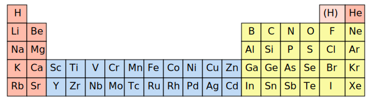
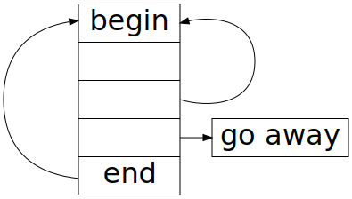
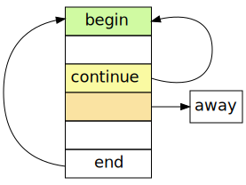
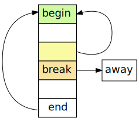

title: Data processing with Python
output: 3-flow.html
style: style.css
theme: /home/as/wrk/seminar/cleaver-ribbon
github-theme: shoorick/cleaver-ribbon
author:
  name: "Alexander Sapozhnikov, Tatyana Vasilieva"
  company: "South Ural State University"
  was-twitter: "@shoorick77"
  email: as@susu.ru
  url: "https://as.susu.ru"
-- title clear
## Data processing with Python
<figure>
    
    <figcaption class="copyright right white">
        © Mike Wesemann
    </figcaption>
</figure>
-- clear
<h2 class="shout shrink">Part 3</h2>
--
## Part 3
### Control flow and loops

* Conditional statement
* Loops and iterators
* Code reuse: functions, modules, and libraries

See also [docs.python.org / Tutorial / More Control Flow Tools](https://docs.python.org/3.7/tutorial/controlflow.html)
--
## Let’s imagine a song

* Introduction
* First verse
* Refrain
* Second verse
* Refrain, refrain, refrain...
--
## Let’s imagine a song

* <mark>**if** pianist is here **then** play an introduction</mark>
* First verse
* Refrain
* Second verse
* Refrain, refrain, refrain...
--
## Parse first line

* **if** <mark class="green">pianist is here</mark>
<mark>**then**</mark> <mark class="orange">play an introduction</mark>

--
## Rewrite in Python-like pseudocode

* **if** <mark class="green">pianist is here</mark>
<mark>**then**</mark> <mark class="orange">play an introduction</mark>

<pre><code>   <span class="comment">↓ condition</span>
<span class="hljs-keyword">if</span> <mark class="green">pianist is here</mark> <mark>:</mark>
    <mark class="orange">play an introduction</mark>
    <span class="comment">↑ action</span>
</code></pre>
--
## Conditional statement

Colon and indent instead of curly braces for blocks

<pre>
<code><span class="hljs-keyword">if</span> (x &lt; <span class="hljs-number">5</span>)<mark>:</mark>
<mark>    </mark><span class="hljs-comment"># four spaces indent is recommended</span>
<mark>    </mark>print(x)</code>
</pre>
--
## Conditional statement

Parentheses around condition aren’t necessary

<pre>
<code><span class="hljs-keyword">if</span> <mark> </mark>x &lt; <span class="hljs-number">5</span><mark> </mark>:
    <span class="hljs-comment"># omit parentheses</span>
    print(x)</code>
</pre>
--
## Conditional statement

Parentheses around condition aren’t necessary

<pre>
<code><span class="hljs-keyword">if</span> <mark>x &lt; 5</mark> <span class="hljs-keyword">and</span> <mark>y &gt; 7</mark>:
    <span class="hljs-comment"># omit parentheses when possible</span>
    print(x)</code>
</pre>

See also [docs.python.org / Tutorial / Expressions # Operator precedence](https://docs.python.org/3.7/reference/expressions.html#operator-precedence)
--
## Chained comparison

```python
# instead of
if temperature > 21 and temperature < 26:
# write
if 21 < temperature < 26:
    '''
    Comfortable
    '''
```
--
## Chained comparison

```python
# or even
if 21 < outdoor_temperature < indoor_temperature < 26:
    '''
    Comfortable but external temperature
    is a bit lower than internal one
    '''
```
--
## Else

<pre>
<code><span class="hljs-keyword">if</span> x &lt; <span class="hljs-number">5</span>:
    print(x)
<mark>else:</mark>
    <span class="hljs-comment"># otherwise</span>
    print(something_else)
</code>
</pre>
--
## else if → elif

<pre>
<code><span class="hljs-keyword">if</span> x &lt; <span class="hljs-number">5</span>:
    print(<span class="hljs-string">'Few'</span>)
<mark class="green">elif</mark> x &gt; <span class="hljs-number">9</span>:
    <span class="hljs-comment"># second condition</span>
    print(<span class="hljs-string">'Many'</span>)
<span class="hljs-keyword">else</span>:
    print(something_else)
</code>
</pre>
--
## else if → elif

<pre>
<code><span class="hljs-keyword">if</span> x &lt; <span class="hljs-number">5</span><mark>:</mark>
    print(<span class="hljs-string">'Few'</span>)
<span class="hljs-keyword">elif</span> x &gt; <span class="hljs-number">9</span><mark>:</mark>
    <span class="hljs-comment"># second condition</span>
    print(<span class="hljs-string">'Many'</span>)
<span class="hljs-keyword">else</span><mark>:</mark>
    print(something_else)
</code>
</pre>
--
## else if → elif

<div class="two columns">
<div>
<pre>
<code><span class="hljs-keyword">if</span> x &lt; <span class="hljs-number">5</span><mark>:</mark>
    print(<span class="hljs-string">'Few'</span>)
<mark class="green">elif</mark> x &gt; <span class="hljs-number">9</span><mark>:</mark>
    print(<span class="hljs-string">'Many'</span>)
<mark class="green">elif</mark> x &gt; <span class="hljs-number">7</span><mark>:</mark>
    print(<span class="hljs-string">'Not so many'</span>)
<mark class="green">elif</mark> z == <span class="hljs-number">42</span><mark>:</mark>
</code>
</pre>
</div><div>
<br><br>
as many <code class="green">elif</code>s
<br>as you wish
</div></div>
--
## `=` is not a comparison operator

<pre>
<code><span class="hljs-meta">&gt;&gt;&gt;</span> <span class="hljs-keyword">if</span> z <mark class="important">=</mark> 7:
<span class="error">  File "&lt;stdin&gt;", line 1
    if z = 7:
         ^
SyntaxError: invalid syntax</span>
</code>
</pre>

--
## `=` and `==`

### Assignment
<pre>
<code>z <mark class="orange">=</mark> 7
</code>
</pre>

### Comparison

<pre>
<code><span class="hljs-keyword">if</span> z <mark class="green">==</mark> 42:
    <span class="comment">print(z)</span>
</code>
</pre>
--
## Loops
  * for
  * while
  * with
--
## Assignment with if/else

<div class="two columns">
<div>
&nbsp;
<pre><code>if x &lt; 5:
    <mark>z</mark> = 'Few'
else:
    <mark>z</mark> = 'Many'
</code></pre></div>
</div>
--
## Assignment with if/else

<div class="two columns">
<div>

**instead of**

<pre><code>if x &lt; 5:
    <mark>z</mark> = 'Few'
else:
    <mark>z</mark> = 'Many'
</code></pre>
</div><div>

**write**

<div><pre><code><mark>z</mark> = 'Few' if x < 5 else 'Many'</code>
</pre>
</div>
</div>
--
## Error handling

<pre><code>&gt;&gt;&gt; stuff = ['hydrogen', 'helium', 'lithium']
&gt;&gt;&gt; <mark>number</mark> = input('Enter number of element ')
Enter number of element <mark>42</mark>
&gt;&gt;&gt; print(stuff[int(<mark>number</mark>)])
<span class="error">Traceback (most recent call last):
  File "&lt;stdin&gt;", line 1, in &lt;module&gt;
<mark class="orange">IndexError</mark>: list index out of range</span>
</code></pre>
--
## Handle exceptions with `try` statement

<pre><code>&gt;&gt;&gt; <mark>try:</mark>
...     print(stuff[int(number)])
... <mark class="orange">except IndexError</mark>:
...     print(f'Wrong index. Use number less than {len(stuff)}')
...
Wrong index. Use number less than 3
</code></pre>
--
## What if `number == 'z'`?

<pre><code>&gt;&gt;&gt; <mark>try:</mark>
...     print(stuff[int(number)])
... <mark class="orange">except IndexError</mark>:
...     print(f'Wrong index. Use number less than {len(stuff)}')
...
<span class="error">Traceback (most recent call last):
  File "<stdin>", line 2, in <module>
<mark class="orange">ValueError</mark>: invalid literal for int() with base 10: 'z'</span>
</code></pre>
--
## Add new exception handler

<pre><code>&gt;&gt;&gt; <mark>try:</mark>
...     print(stuff[int(number)])
... <mark class="orange">except IndexError</mark>:
...     print(f'Wrong index. Use number less than {len(stuff)}')
... <mark class="orange">except ValueError</mark>:
...     print(f'Index must be an integer number')
</code></pre>
--
## Add `else` when there is no any exception
<pre><code>&gt;&gt;&gt; <mark>try:</mark> <span class="comment"># number == 2</span>
...     print(stuff[int(number)])
... <span class="comment"># skipped</span>
... <mark class="green">else</mark>:
...     print('OK')
...
lithium
OK
</code></pre>
--
## `finally` is executing after all checks
<div class="two columns">
<div>
<pre><code>... <span class="comment"># skipped</span>
... <mark class="green">else</mark>:
...     print('OK')
... <mark class="blue">finally</mark>:
...     print("That's all folks!")
...</code></pre>
</div><div>
<h3>output:</h3>
<pre><code>lithium
OK
That's all folks!
</code></pre>
</div></div>
--
## `finally` is executing after all checks
<div class="two columns">
<div>
<pre><code><mark>try:</mark>
...     print(stuff[int(number)])
... <mark class="orange">except IndexError</mark>:
...     print(f'Wrong index...
... <span class="comment"># skipped</span>
... <mark class="blue">finally</mark>:
...     print("That's all folks!")</code></pre>
</div><div>
when `number` is wrong
<h3>output:</h3>
<pre><code>Wrong index. Use number less than 3
That's all folks!
</code></pre>
</div></div>

--
<h2 class="shout">Loops</h2>
--
## <mark>for</mark> loop

<pre><code>
for <mark class="orange">item</mark> in <mark class="green">sequence</mark>:
    <span class="comment"># do something</span>
</code></pre>
--
## Iterate through list

<pre><code>
people = ['Alice', 'Bob', 'Charlie']
for <mark class="orange">person</mark> in <mark class="green">people</mark>:
    print(person)
</code></pre>
--
## Iterate over range

<pre><code>
teen = range(13, 20)
for <mark class="orange">age</mark> in <mark class="green">teen</mark>:
    print(f'Age is {age}')
</code></pre>
--
## Iterate over range

<pre><code>
teen = range(13, 20)
for <mark class="orange">age</mark> in <mark class="green">teen</mark>:
    print(f'Age is {age}')

for <mark class="orange">i</mark> in <mark class="green">range(10)</mark>:
    do_something() <span class="comment"># ten times</span>
</code></pre>
--
## Counter name

`i`, `j`, `k` (and `x`, `y`, `z`) are good names for counter variables
<pre><code>
for <mark class="orange">x</mark> in width:
    for <mark>y</mark> in height:
        for <mark class="green">z</mark> in depth:
            do_something(<mark class="orange">x</mark>, <mark>y</mark>, <mark class="green">z</mark>)
</code></pre>
--
## How to iterate over several sequences simultaneously?

<pre><code>
<mark class="orange">colors</mark> = ['red',   'orange', 'yellow'  ]
<mark>people</mark> = ['Alice', 'Bob',    'Charlie' ]
<mark class="green">fruits</mark> = ['apple', 'banana', 'cucumber']
</code></pre>
--
## How to iterate over several sequences simultaneously?

<pre><code>
colors = [<mark class="blue">'red',  </mark> 'orange', 'yellow'  ]
people = [<mark class="blue">'Alice',</mark> 'Bob',    'Charlie' ]
fruits = [<mark class="blue">'apple',</mark> 'banana', 'cucumber']
</code></pre>
--
## How to iterate over several sequences simultaneously?

<pre><code>
colors = ['red',   <mark class="blue">'orange',</mark> 'yellow'  ]
people = ['Alice', <mark class="blue">'Bob',   </mark> 'Charlie' ]
fruits = ['apple', <mark class="blue">'banana',</mark> 'cucumber']
</code></pre>
--
## How to iterate over several sequences simultaneously?

<pre><code>
colors = ['red',   'orange', <mark class="blue">'yellow'  </mark>]
people = ['Alice', 'Bob',    <mark class="blue">'Charlie' </mark>]
fruits = ['apple', 'banana', <mark class="blue">'cucumber'</mark>]
</code></pre>
--
## zip

<pre>
<code>&gt;&gt;&gt; for <mark class="orange">color</mark>, <mark>name</mark>, <mark class="green">fruit</mark> in zip(<mark class="orange">colors</mark>, <mark>people</mark>, <mark class="green">fruits</mark>):
...     print(f'{<mark>name</mark>} has {<mark class="orange">color</mark>} {<mark class="green">fruit</mark>}')
...
Alice has red apple
<mark>Bob</mark> has <mark class="orange">orange</mark> <mark class="green">banana</mark>
Charlie</mark> has yellow cucumber
</code></pre>
--
## How to enumerate items?

1. First
2. Second
3. Third
4. Fourth
5. Fifth

--
## Example: chemical elements
```python
>>> stuff = ['hydrogen', 'helium', 'lithium']
```


--
## Classic way
```python
>>> stuff = ['hydrogen', 'helium', 'lithium']
>>> for i in range(len(stuff)):
...     print(i + 1, stuff[i])
...
1 hydrogen
2 helium
3 lithium
```
--
## Use zip and range for numbering

```python
>>> for number, name in zip(range(1, len(stuff) + 1), stuff):
...     print(number, name)
...
1 hydrogen
2 helium
3 lithium
```
--
## enumerate
```python
>>> for number, name in enumerate(stuff):
...     print(number, name)
...
0 hydrogen
1 helium
2 lithium
```
--
## enumerate

<pre>
<code>&gt;&gt;&gt; for number, name in enumerate(stuff, <mark>start=1</mark>):
...     print(number, name)
...
<mark>1</mark> hydrogen
<mark>2</mark> helium
<mark>3</mark> lithium
</code></pre>
--
## Iterate over dict — see its methods

<pre>
<code>&gt;&gt;&gt; fruits = {'apple': 'red', 'banana': 'yellow', 'cucumber': 'green'}
&gt;&gt;&gt; fruits.<mark>items</mark>()
dict_items([('apple', 'red'), ('banana', 'yellow'), ('cucumber', 'green')])
&gt;&gt;&gt; fruits.<mark class="green">keys</mark>()
dict_keys(['apple', 'banana', 'cucumber'])
&gt;&gt;&gt; fruits.<mark class="orange">values</mark>()
dict_values(['red', 'yellow', 'green'])
</code></pre>
--
## Iterate over whole dict

<pre>
<code>&gt;&gt;&gt; for fruit, color in fruits.<mark>items</mark>():
...     print(f'{fruit} is {color}')
...
apple is red
banana is yellow
cucumber is green
</code></pre>
--
## Iterate over keys of dict

<pre>
<code>&gt;&gt;&gt; for fruit in fruits.<mark class="green">keys</mark>():
...     print(fruits[fruit], fruit)
...
red apple
yellow banana
green cucumber
</code></pre>
--
## while

<pre>
<code>while <mark>condition:</mark>
    <span class="comment"># do something</span>
</code></pre>
--
## while

<pre>
<code>&gt;&gt;&gt; rest = 3
&gt;&gt;&gt; while <mark>rest &gt; 0</mark>:
...     print(f'Rest is {rest}')
...     rest -= 1
...
Rest is 3
Rest is 2
Rest is 1
</code></pre>
--
## while

<pre>
<code>&gt;&gt;&gt; rest = 3
&gt;&gt;&gt; while <mark>rest</mark>:
...     print(f'Rest is {rest}')
...     rest -= 1
...
Rest is 3
Rest is 2
Rest is 1
</code></pre>
--
## while

<pre>
<code>&gt;&gt;&gt; rest = 3
&gt;&gt;&gt; while rest:
...     print(f'Rest is {rest}')
...     rest <mark>-=</mark> 1
</code></pre>
--
## Increment and decrement

<pre><code>variable <mark class="green">+=</mark> delta  <span class="comment"># increase</span>
variable <mark class="orange">-=</mark> delta  <span class="comment"># decrease</span>
</code></pre>

Unlike C, C++, Java, JavaScript, Perl, PHP, Ruby etc

### Python has no `++` and `--` operators

--
## Python has no `++` and `--` operators

```python
>>> 3++2  # 3 + +2
5
>>> 4--5  # 4 − (−5) = 4 + 5
9
```

--
## Python has no `++` and `--` operators

```python
>>> 7++
  File "", line 1
    7++
      ^
SyntaxError: invalid syntax
```

--
## Loop
<div class="two columns">
  <div></div>
  <div>

</div></div>
--
## Skip rest of loop with `continue`
<div class="two columns">
  <div>
<pre>
<code>&gt;&gt;&gt; for i in range(1, 5):
...     if i < 3: <mark>continue</mark>
...     print(i)
...
3
4</code></pre>
  </div>
  <div>
    
  </div>
</div>
--
## Go away from loop with `break`
<div class="two columns">
  <div>
<pre>
<code>&gt;&gt;&gt; for i in range(1, 55):
...     print(i)
...     if i > 2: <mark class="orange">break</mark>
...
1
2
3</code></pre>
  </div>
  <div>
    
  </div>
</div>
--
## Python has no postconditional loop

```python
do:
    # do something
    until condition
```

--
## Python has <mark class="orange">no postconditional loop</mark>


```python
do:
    # do something
    until condition
```
--
## Use `break` to emulate it
<pre>
<code>&gt;&gt;&gt; while True: <span class="comment"># infinite loop</span>
...     amount = input('How many? Or type q to quit ')
...     if amount == 'q':
...         <mark class="orange">break</mark>
...
How many? Or type q to quit 4
How many? Or type q to quit q
</code></pre>
--
<h2 class="shout">Code reuse</h2>
--
## Code reuse

* Functions
* Modules
* Libraries

--
## Structure of the song

* First verse
* Refrain
* Second verse
* <mark>Refrain</mark>, <mark>refrain</mark>, <mark>refrain</mark> → _loop_
--
## Structure of the song

* First verse
* <mark>Refrain</mark>
* Second verse
* <mark>Refrain</mark>
* Third verse
* <mark>Refrain</mark>, <mark>refrain</mark>, <mark>refrain</mark>

--
## Structure of the song

* First verse
* <mark>Refrain</mark>
* Second verse
* <mark>Refrain</mark>, <mark class="orange">refrain (shifted pitch)</mark>, <mark class="green">refrain (silent)</mark>

