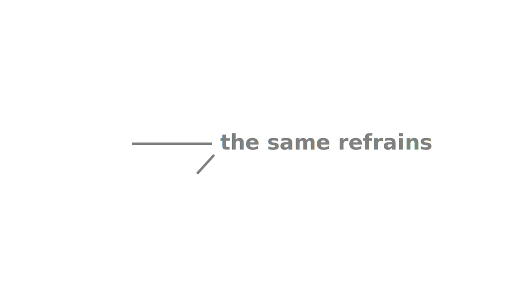
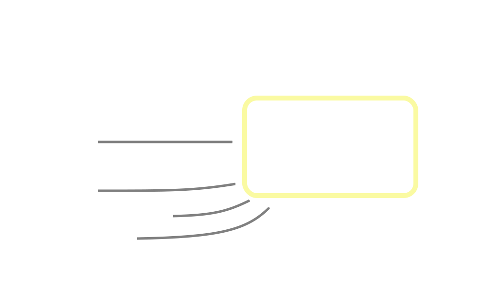

title: Data processing with Python
output: 3-flow.html
style: style.css
theme: /home/as/wrk/seminar/cleaver-ribbon
github-theme: shoorick/cleaver-ribbon
author:
  name: "Alexander Sapozhnikov, Tatyana Vasilieva"
  company: "South Ural State University"
  was-twitter: "@shoorick77"
  email: as@susu.ru
  url: "https://as.susu.ru"
-- title clear
## Data processing with Python
<figure>
    
    <figcaption class="copyright right white">
        © Mike Wesemann
    </figcaption>
</figure>
-- clear
<h2 class="shout shrink">Part 3</h2>
--
## Part 3
### Control flow and loops

* Conditional statement
* Loops and iterators
* Code reuse: functions, modules, and libraries

See also [docs.python.org / Tutorial / More Control Flow Tools](https://docs.python.org/3.7/tutorial/controlflow.html)
--
## Let’s imagine a song

* Introduction
* First verse
* Refrain
* Second verse
* Refrain, refrain, refrain...
--
## Let’s imagine a song

* <mark>**if** pianist is here **then** play an introduction</mark>
* First verse
* Refrain
* Second verse
* Refrain, refrain, refrain...
--
## Parse first line

* **if** <mark class="green">pianist is here</mark>
<mark>**then**</mark> <mark class="orange">play an introduction</mark>

--
## Rewrite in Python-like pseudocode

* **if** <mark class="green">pianist is here</mark>
<mark>**then**</mark> <mark class="orange">play an introduction</mark>

<pre><code>   <span class="comment">↓ condition</span>
<span class="hljs-keyword">if</span> <mark class="green">pianist.is_here</mark> <mark>:</mark>
    <mark class="orange">play_an_introduction()</mark>
    <span class="comment">↑ action</span>
</code></pre>
--
## Conditional statement

Colon and indent instead of curly braces for blocks

<pre>
<code><span class="hljs-keyword">if</span> (x &lt; <span class="hljs-number">5</span>)<mark>:</mark>
<mark>    </mark><span class="hljs-comment"># four spaces indent is recommended</span>
<mark>    </mark>print(x)</code>
</pre>
--
## Conditional statement

Parentheses around condition aren’t necessary

<pre>
<code><span class="hljs-keyword">if</span> <mark> </mark>x &lt; <span class="hljs-number">5</span><mark> </mark>:
    <span class="hljs-comment"># omit parentheses</span>
    print(x)</code>
</pre>
--
## Conditional statement

Parentheses around condition aren’t necessary

<pre>
<code><span class="hljs-keyword">if</span> <mark>x &lt; 5</mark> <span class="hljs-keyword">and</span> <mark>y &gt; 7</mark>:
    <span class="hljs-comment"># omit parentheses when possible</span>
    print(x)</code>
</pre>

See also [docs.python.org / Tutorial / Expressions # Operator precedence](https://docs.python.org/3.7/reference/expressions.html#operator-precedence)
--
## Chained comparison

```python
# instead of
if temperature > 21 and temperature < 26:
# write
if 21 < temperature < 26:
    '''
    Comfortable
    '''
```
--
## Chained comparison

```python
# or even
if 21 < outdoor_temperature < indoor_temperature < 26:
    '''
    Comfortable but external temperature
    is a bit lower than internal one
    '''
```
--
## Else

<pre>
<code><span class="hljs-keyword">if</span> x &lt; <span class="hljs-number">5</span>:
    print(x)
<mark>else:</mark>
    <span class="hljs-comment"># otherwise</span>
    print(something_else)
</code>
</pre>
--
## else if → elif

<pre>
<code><span class="hljs-keyword">if</span> x &lt; <span class="hljs-number">5</span>:
    print(<span class="hljs-string">'Few'</span>)
<mark class="green">elif</mark> x &gt; <span class="hljs-number">9</span>:
    <span class="hljs-comment"># second condition</span>
    print(<span class="hljs-string">'Many'</span>)
<span class="hljs-keyword">else</span>:
    print(something_else)
</code>
</pre>
--
## else if → elif

<pre>
<code><span class="hljs-keyword">if</span> x &lt; <span class="hljs-number">5</span><mark>:</mark>
    print(<span class="hljs-string">'Few'</span>)
<span class="hljs-keyword">elif</span> x &gt; <span class="hljs-number">9</span><mark>:</mark>
    <span class="hljs-comment"># second condition</span>
    print(<span class="hljs-string">'Many'</span>)
<span class="hljs-keyword">else</span><mark>:</mark>
    print(something_else)
</code>
</pre>
--
## else if → elif

<div class="two columns">
<div>
<pre>
<code><span class="hljs-keyword">if</span> x &lt; <span class="hljs-number">5</span><mark>:</mark>
    print(<span class="hljs-string">'Few'</span>)
<mark class="green">elif</mark> x &gt; <span class="hljs-number">9</span><mark>:</mark>
    print(<span class="hljs-string">'Many'</span>)
<mark class="green">elif</mark> x &gt; <span class="hljs-number">7</span><mark>:</mark>
    print(<span class="hljs-string">'Not so many'</span>)
<mark class="green">elif</mark> z == <span class="hljs-number">42</span><mark>:</mark>
</code>
</pre>
</div><div>
<br><br>
as many <code class="green">elif</code>s
<br>as you wish
</div></div>
--
## `=` is not a comparison operator

<pre>
<code><span class="hljs-meta">&gt;&gt;&gt;</span> <span class="hljs-keyword">if</span> z <mark class="important">=</mark> 7:
<span class="error">  File "&lt;stdin&gt;", line 1
    if z = 7:
         ^
SyntaxError: invalid syntax</span>
</code>
</pre>

--
## `=` and `==`

<div class="two columns"><div>
<h3>Assignment</h3>
<pre>
<code>z <mark class="orange">=</mark> 7
</code>
</pre>
</div><div>
<h3>Comparison</h3>
<pre>
<code><span class="hljs-keyword">if</span> z <mark class="green">==</mark> <span class="hljs-number">42</span>:
    <span class="comment">print(z)</span>
</code>
</pre>
</div></div>
--
## Assignment with if/else

<div class="two columns">
<div>
&nbsp;
<pre><code><span class="hljs-keyword">if</span> x &lt; <span class="hljs-number">5</span>:
    <mark>z</mark> = <span class="hljs-string">'Few'</span>
<span class="hljs-keyword">else</span>:
    <mark>z</mark> = <span class="hljs-string">'Many'</span>
</code></pre></div>
</div>
--
## Assignment with if/else

<div class="two columns">
<div>

**instead of**

<pre><code><span class="hljs-keyword">if</span> x &lt; <span class="hljs-number">5</span>:
    <mark>z</mark> = <span class="hljs-string">'Few'</span>
<span class="hljs-keyword">else</span>:
    <mark>z</mark> = <span class="hljs-string">'Many'</span>
</code></pre>
</div><div>

**write**

<div><pre><code><mark>z</mark> = <span class="hljs-string">'Few'</span> <span class="hljs-keyword">if</span> x &lt; <span class="hljs-number">5</span> <span class="hljs-keyword">else</span> <span class="hljs-string">'Many'</span></code>
</pre>
</div>
</div>

--
## Let’s remember song example

<pre><code><span class="hljs-keyword">if</span> <mark class="green">pianist.is_here</mark> <mark>:</mark>
    <mark class="orange">play_an_introduction()</mark></code></pre>
--
## Try to play immediately!

<pre><code>
    play_an_introduction()

<span class="error"><mark class="orange">SomeError</mark>: we have no pianist to play anything</span>
</code></pre>
--
## Error handling

<pre><code><span class="hljs-meta">&gt;&gt;&gt;</span> stuff = [<span class="hljs-string">'hydrogen'</span>, <span class="hljs-string">'helium'</span>, <span class="hljs-string">'lithium'</span>]
<span class="hljs-meta">&gt;&gt;&gt;</span> <mark>number</mark> = input(<span class="hljs-string">'Enter number of element '</span>)
Enter number of element <mark>42</mark>
<span class="hljs-meta">&gt;&gt;&gt;</span> print(stuff[int(<mark>number</mark>)])
<span class="error">Traceback (most recent call last):
  File "&lt;stdin&gt;", line 1, in &lt;module&gt;
<mark class="orange">IndexError</mark>: list index out of range</span>
</code></pre>
--
## Handle exceptions with `try` statement

<pre><code><span class="hljs-meta">&gt;&gt;&gt;</span> <mark>try:</mark>
<span class="hljs-meta">...</span>     print(stuff[int(number)])
<span class="hljs-meta">...</span> <mark class="orange">except IndexError</mark>:
<span class="hljs-meta">...</span>     print(<span class="hljs-string">f'Wrong index. Use number less than {len(stuff)}'</span>)
<span class="hljs-meta">...</span>
Wrong index. Use number less than 3
</code></pre>
--
## What if `number == 'z'`?

<pre><code><span class="hljs-meta">&gt;&gt;&gt;</span> <mark>try:</mark>
<span class="hljs-meta">...</span>     print(stuff[int(number)])
<span class="hljs-meta">...</span> <mark class="orange">except IndexError</mark>:
<span class="hljs-meta">...</span>     print(<span class="hljs-string">f'Wrong index. Use number less than {len(stuff)}'</span>)
<span class="hljs-meta">...</span>
<span class="error">Traceback (most recent call last):
  File "<stdin>", line 2, in <module>
<mark class="orange">ValueError</mark>: invalid literal for int() with base 10: 'z'</span>
</code></pre>
--
## Add new exception handler

<pre><code><span class="hljs-meta">&gt;&gt;&gt;</span> <mark>try:</mark>
<span class="hljs-meta">...</span>     print(stuff[int(number)])
<span class="hljs-meta">...</span> <mark class="orange">except IndexError</mark>:
<span class="hljs-meta">...</span>     print(<span class="hljs-string">f'Wrong index. Use number less than {len(stuff)}'</span>)
<span class="hljs-meta">...</span> <mark class="orange">except ValueError</mark>:
<span class="hljs-meta">...</span>     print(<span class="hljs-string">f'Index must be an integer number'</span>)
</code></pre>
--
## Add `else` when there is no exception
<pre><code><span class="hljs-meta">&gt;&gt;&gt;</span> <mark>try:</mark> <span class="hljs-comment"># number == 2</span>
<span class="hljs-meta">...</span>     print(stuff[int(number)])
<span class="hljs-meta">...</span> <span class="hljs-comment"># skipped</span>
<span class="hljs-meta">...</span> <mark class="green">else</mark>:
<span class="hljs-meta">...</span>     print(<span class="hljs-string">'OK'</span>)
<span class="hljs-meta">...</span>
lithium
OK
</code></pre>
--
## `finally` is executing after all checks
<div class="two columns">
<div>
<pre><code><span class="hljs-meta">...</span> <span class="hljs-comment"># skipped</span>
<span class="hljs-meta">...</span> <mark class="green">else</mark>:
<span class="hljs-meta">...</span>     print(<span class="hljs-string">'OK'</span>)
<span class="hljs-meta">...</span> <mark class="blue">finally</mark>:
<span class="hljs-meta">...</span>     print(<span class="hljs-string">"That's all, folks!"</span>)
<span class="hljs-meta">...</span></code></pre>
</div><div>
<h3>output:</h3>
<pre><code>lithium
OK
That's all, folks!
</code></pre>
</div></div>
--
## `finally` is executing after all checks
<div class="two columns">
<div>
<pre><code><span class="hljs-meta">&gt;&gt;&gt;</span> <mark>try:</mark>
<span class="hljs-meta">...</span>     print(stuff[int(number)])
<span class="hljs-meta">...</span> <mark class="orange">except IndexError</mark>:
<span class="hljs-meta">...</span>     print(<span class="hljs-string">f'Wrong index...</span>
<span class="hljs-meta">...</span> <span class="hljs-comment"># skipped</span>
<span class="hljs-meta">...</span> <mark class="blue">finally</mark>:
<span class="hljs-meta">...</span>     print(<span class="hljs-string">"That's all, folks!"</span>)</code></pre>
</div><div>
when `number` is wrong
<h3>output:</h3>
<pre><code>Wrong index. Use number less than 3
That's all, folks!
</code></pre>
</div></div>
--
<h2 class="shout">Loops</h2>
--
## Structure of the song

* Introduction
* First verse
* Refrain
* Second verse
* <mark>Refrain</mark>, <mark>refrain</mark>, <mark>refrain</mark> → _loop_


--
## Loops
  * for
  * while
  * with
--
## `for` loop

<pre><code>
<span class="hljs-keyword">for</span> <mark class="orange">item</mark> <span class="hljs-keyword">in</span> <mark class="green">sequence</mark>:
    <span class="hljs-comment"># do something</span>
</code></pre>
--
## Iterate through list

<pre><code>
people = [<span class="hljs-string">'Alice'</span>, <span class="hljs-string">'Bob'</span>, <span class="hljs-string">'Charlie'</span>]
<span class="hljs-keyword">for</span> <mark class="orange">person</mark> <span class="hljs-keyword">in</span> <mark class="green">people</mark>:
    print(person)
</code></pre>
--
## Iterate over range

<pre><code>
teen = range(13, 20)
<span class="hljs-keyword">for</span> <mark class="orange">age</mark> <span class="hljs-keyword">in</span> <mark class="green">teen</mark>:
    print(<span class="hljs-string">f'Age is {age}'</span>)
</code></pre>
--
## Iterate over range

<pre><code>
teen = range(13, 20)
<span class="hljs-keyword">for</span> <mark class="orange">age</mark> <span class="hljs-keyword">in</span> <mark class="green">teen</mark>:
    print(<span class="hljs-string">f'Age is {age}'</span>)

<span class="hljs-keyword">for</span> <mark class="orange">i</mark> <span class="hljs-keyword">in</span> <mark class="green">range(10)</mark>:
    do_something() <span class="hljs-comment"># ten times</span>
</code></pre>
--
## Counter name

`i`, `j`, `k` (and `x`, `y`, `z`) are good names for counter variables
<pre><code>
<span class="hljs-keyword">for</span> <mark class="orange">x</mark> <span class="hljs-keyword">in</span> width:
    <span class="hljs-keyword">for</span> <mark>y</mark> <span class="hljs-keyword">in</span> height:
        <span class="hljs-keyword">for</span> <mark class="green">z</mark> <span class="hljs-keyword">in</span> depth:
            do_something(<mark class="orange">x</mark>, <mark>y</mark>, <mark class="green">z</mark>)
</code></pre>
--
## Nested loops

Put a loop inside another one
<pre><code>
<span class="hljs-keyword">for</span> <mark class="orange">x</mark> <span class="hljs-keyword">in</span> width:
    <span class="hljs-keyword">for</span> <mark>y</mark> <span class="hljs-keyword">in</span> height:
        <span class="hljs-keyword">for</span> <mark class="green">z</mark> <span class="hljs-keyword">in</span> depth:
            do_something(<mark class="orange">x</mark>, <mark>y</mark>, <mark class="green">z</mark>)
</code></pre>

--
## How to iterate over several sequences simultaneously?

<pre><code>
<mark class="orange">colors</mark> = ['red',   'orange', 'yellow'  ]
<mark>people</mark> = ['Alice', 'Bob',    'Charlie' ]
<mark class="green">fruits</mark> = ['apple', 'banana', 'cucumber']
</code></pre>
--
## How to iterate over several sequences simultaneously?

<pre><code>
colors = [<mark class="blue">'red',  </mark> 'orange', 'yellow'  ]
people = [<mark class="blue">'Alice',</mark> 'Bob',    'Charlie' ]
fruits = [<mark class="blue">'apple',</mark> 'banana', 'cucumber']
</code></pre>
--
## How to iterate over several sequences simultaneously?

<pre><code>
colors = ['red',   <mark class="blue">'orange',</mark> 'yellow'  ]
people = ['Alice', <mark class="blue">'Bob',   </mark> 'Charlie' ]
fruits = ['apple', <mark class="blue">'banana',</mark> 'cucumber']
</code></pre>
--
## How to iterate over several sequences simultaneously?

<pre><code>
colors = ['red',   'orange', <mark class="blue">'yellow'  </mark>]
people = ['Alice', 'Bob',    <mark class="blue">'Charlie' </mark>]
fruits = ['apple', 'banana', <mark class="blue">'cucumber'</mark>]
</code></pre>
--
## zip

<pre>
<code><span class="hljs-meta">&gt;&gt;&gt;</span> <span class="hljs-keyword">for</span> <mark class="orange">color</mark>, <mark>name</mark>, <mark class="green">fruit</mark> <span class="hljs-keyword">in</span> zip(<mark class="orange">colors</mark>, <mark>people</mark>, <mark class="green">fruits</mark>):
<span class="hljs-meta">...</span>     print(<span class="hljs-string">f'{<mark>name</mark>} has {<mark class="orange">color</mark>} {<mark class="green">fruit</mark>}'</span>)
<span class="hljs-meta">...</span>
Alice has red apple
<mark>Bob</mark> has <mark class="orange">orange</mark> <mark class="green">banana</mark>
Charlie</mark> has yellow cucumber
</code></pre>
--
## How to enumerate items?

1. First
2. Second
3. Third
4. Fourth
5. Fifth

--
## Example: chemical elements
```python
>>> stuff = ['hydrogen', 'helium', 'lithium']
```


--
## Classic way
```python
>>> stuff = ['hydrogen', 'helium', 'lithium']
>>> for i in range(len(stuff)):
...     print(i + 1, stuff[i])
...
1 hydrogen
2 helium
3 lithium
```
--
## Use zip and range for numbering

```python
>>> for number, name in zip(range(1, len(stuff) + 1), stuff):
...     print(number, name)
...
1 hydrogen
2 helium
3 lithium
```
--
## enumerate
```python
>>> for number, name in enumerate(stuff):
...     print(number, name)
...
0 hydrogen
1 helium
2 lithium
```
--
## enumerate

<pre>
<code><span class="hljs-meta">&gt;&gt;&gt;</span> <span class="hljs-keyword">for</span> number, name <span class="hljs-keyword">in</span> enumerate(stuff, <mark>start=1</mark>):
<span class="hljs-meta">...</span>     print(number, name)
<span class="hljs-meta">...</span>
<mark>1</mark> hydrogen
<mark>2</mark> helium
<mark>3</mark> lithium
</code></pre>
--
## Iterate over dict

<pre>
<code><span class="hljs-meta">&gt;&gt;&gt;</span> fruits = {
    <span class="hljs-string">'apple'</span>: <span class="hljs-string">'red'</span>,
    <span class="hljs-string">'banana'</span>: <span class="hljs-string">'yellow'</span>,
    <span class="hljs-string">'cucumber'</span>: <span class="hljs-string">'green'</span>,
}
</code></pre>
--
## Iterate over dict — see its methods

<pre>
<code><span class="hljs-meta">&gt;&gt;&gt;</span> fruits = {<span class="hljs-string">'apple'</span>: <span class="hljs-string">'red'</span>, <span class="hljs-string">'banana'</span>: <span class="hljs-string">'yellow'</span>, <span class="hljs-string">'cucumber'</span>: <span class="hljs-string">'green'</span>}
<span class="hljs-meta">&gt;&gt;&gt;</span> fruits.<mark>items</mark>()
dict_items([('apple', 'red'), ('banana', 'yellow'), ('cucumber', 'green')])
<span class="hljs-meta">&gt;&gt;&gt;</span> fruits.<mark class="green">keys</mark>()
dict_keys(['apple', 'banana', 'cucumber'])
<span class="hljs-meta">&gt;&gt;&gt;</span> fruits.<mark class="orange">values</mark>()
dict_values(['red', 'yellow', 'green'])
</code></pre>
--
## Iterate over dict — see its methods

<pre>
<code><span class="hljs-meta">&gt;&gt;&gt;</span> fruits = {<span class="hljs-string">'apple'</span>: <span class="hljs-string">'red'</span>, <span class="hljs-string">'banana'</span>: <span class="hljs-string">'yellow'</span>, <span class="hljs-string">'cucumber'</span>: <span class="hljs-string">'green'</span>}
<span class="hljs-meta">&gt;&gt;&gt;</span> fruits.<mark>items</mark>()
dict_items(<mark class="orange">[</mark> <mark class="green">(</mark>'apple', 'red'<mark class="green">)</mark>, <mark class="green">(</mark>'banana', 'yellow'<mark class="green">)</mark>, <mark class="green">(</mark>'cucumber', 'green'<mark class="green">)</mark>] <mark class="orange">]</mark> )
</code></pre>

<mark class="orange">List</mark> of <mark class="green">tuples</mark>

--
## Iterate over whole dict

<pre>
<code><span class="hljs-meta">&gt;&gt;&gt;</span> <span class="hljs-keyword">for</span> fruit, color <span class="hljs-keyword">in</span> fruits.<mark>items</mark>():
<span class="hljs-meta">...</span>     print(<span class="hljs-string">f'{fruit} is {color}'</span>)
<span class="hljs-meta">...</span>
apple is red
banana is yellow
cucumber is green
</code></pre>


--
## Iterate over keys of dict

<pre>
<code><span class="hljs-meta">&gt;&gt;&gt;</span> <span class="hljs-keyword">for</span> fruit <span class="hljs-keyword">in</span> fruits.<mark class="green">keys</mark>():
<span class="hljs-meta">...</span>     print(fruits[fruit], fruit)
<span class="hljs-meta">...</span>
red apple
yellow banana
green cucumber
</code></pre>
--
## while

<pre>
<code><span class="hljs-keyword">while</span> <mark>condition:</mark>
    <span class="hljs-comment"># do something</span>
</code></pre>
--
## while

<pre>
<code><span class="hljs-meta">&gt;&gt;&gt;</span> rest = <span class="hljs-number">3</span>
<span class="hljs-meta">&gt;&gt;&gt;</span> <span class="hljs-keyword">while</span> <mark>rest &gt; 0</mark>:
<span class="hljs-meta">...</span>     print(<span class="hljs-string">f'Rest is {rest}'</span>)
<span class="hljs-meta">...</span>     rest -= <span class="hljs-number">1</span>
<span class="hljs-meta">...</span>
Rest is 3
Rest is 2
Rest is 1
</code></pre>
--
## while

<pre>
<code><span class="hljs-meta">&gt;&gt;&gt;</span> rest = <span class="hljs-number">3</span>
<span class="hljs-meta">&gt;&gt;&gt;</span> <span class="hljs-keyword">while</span> <mark>rest</mark>:
<span class="hljs-meta">...</span>     print(<span class="hljs-string">f'Rest is {rest}'</span>)
<span class="hljs-meta">...</span>     rest -= <span class="hljs-number">1</span>
<span class="hljs-meta">...</span>
Rest is 3
Rest is 2
Rest is 1
</code></pre>
--
## while

<pre>
<code><span class="hljs-meta">&gt;&gt;&gt;</span> rest = <span class="hljs-number">3</span>
<span class="hljs-meta">&gt;&gt;&gt;</span> <span class="hljs-keyword">while</span> rest:
<span class="hljs-meta">...</span>     print(<span class="hljs-string">f'Rest is {rest}'</span>)
<span class="hljs-meta">...</span>     rest <mark>-=</mark> <span class="hljs-number">1</span>
</code></pre>
--
## Increment and decrement

<pre><code>variable <mark class="green">+=</mark> delta  <span class="hljs-comment"># increase</span>
variable <mark class="orange">-=</mark> delta  <span class="hljs-comment"># decrease</span>
</code></pre>

Unlike C, C++, Java, JavaScript, Perl, PHP, Ruby etc

### Python has no `++` and `--` operators

--
## Python has no `++` and `--` operators

```python
>>> 3++2  # 3 + +2
5
>>> 4--5  # 4 − (−5) = 4 + 5
9
```

--
## Python has no `++` and `--` operators

```python
>>> 7++
  File "", line 1
    7++
      ^
SyntaxError: invalid syntax
```

--
## Loop
<div class="two columns">
  <div></div>
  <div>

</div></div>
--
## Skip rest of loop with `continue`
<div class="two columns">
  <div>
<pre>
<code><span class="hljs-meta">&gt;&gt;&gt;</span> <span class="hljs-keyword">for</span> i <span class="hljs-keyword">in</span> range(1, 5):
<span class="hljs-meta">...</span>     if i < 3: <mark>continue</mark>
<span class="hljs-meta">...</span>     print(i)
<span class="hljs-meta">...</span>
3
4</code></pre>
  </div>
  <div>
    
  </div>
</div>
--
## Go away from loop with `break`
<div class="two columns">
  <div>
<pre>
<code><span class="hljs-meta">&gt;&gt;&gt;</span> <span class="hljs-keyword">for</span> i <span class="hljs-keyword">in</span> range(1, 55):
<span class="hljs-meta">...</span>     print(i)
<span class="hljs-meta">...</span>     if i > 2: <mark class="orange">break</mark>
<span class="hljs-meta">...</span>
1
2
3</code></pre>
  </div>
  <div>
    
  </div>
</div>
--
## What about postconditional loop?

```python
do:
    # do something
    until condition
```

--
## Python has <mark class="orange">no postconditional loop</mark>

```python
do:
    # do something
    until condition
```


--
## Use `break` to emulate it

<pre>
<code class="lang-python"><span class="hljs-meta">&gt;&gt;&gt; </span><span class="hljs-keyword">while</span> <span class="hljs-keyword">True</span>: <span class="hljs-comment"># infinite loop</span>
<span class="hljs-meta">... </span>    amount = input(<span class="hljs-string">'How many? Or type q to quit '</span>)
<span class="hljs-meta">... </span>    <span class="hljs-keyword">if</span> amount == <span class="hljs-string">'q'</span>:
<span class="hljs-meta">...</span>         <mark class="orange">break</mark>
<span class="hljs-meta">...</span>
<span class="next">How many? Or type q to quit <mark>4</mark></next>
<span class="next">How many? Or type q to quit <mark class="orange">q</mark class="orange"></span>
</code></pre>
--
<h2 class="shout">Code reuse</h2>
--
## Code reuse

* Functions
* Modules
* Libraries

--
## Structure of the song

* Introduction
* First verse
* Refrain
* Second verse
* Refrain, refrain, refrain
--
## Structure of the song

* Introduction
* First verse
* <mark>Refrain</mark>
* Second verse
* <mark>Refrain</mark>, <mark>refrain</mark>, <mark>refrain</mark>



--
## Structure of the song

* Introduction
* First verse
* <mark>Refrain</mark>
* Second verse
* <mark>Refrain</mark>, <mark class="orange">refrain (shifted pitch)</mark>, <mark class="green">refrain (silent)</mark>


--
## Structure of the song

<div class="two columns">
<div>
<ul>
<li>Introduction</li>
<li>First verse</li>
<li><mark>Refrain</mark></li>
<li>Second verse</li>
<li><mark>Refrain</mark></li>
<li><mark class="orange">Refrain (shifted pitch)</mark></li>
<li><mark class="green">Refrain (silent)</mark></li>
</ul>
</div><div>

<p>**Refrain** is part of code</p>
<p>Such parts named</p>
<ul>
<li>subroutine</li>
<li>procedure</li>
<li><mark>function</mark></li>
</ul>

</div></div>
--
## Let’s separate <mark>refrain</mark>

<div class="two columns">
<div>
<ul>
<li>Introduction</li>
<li>First verse</li>
<li><mark>Refrain</mark></li>
<li>Second verse</li>
<li><mark>Refrain</mark></li>
<li><mark class="orange">Refrain (shifted pitch)</mark></li>
<li><mark class="green">Refrain (silent)</mark></li>
</ul>
</div><div>

<p>&nbsp;</p>
<p>**Refrain** is part of code</p>
<ul>
<li>function</li>
</ul>

</div></div>


--
## `def`ine a function

```python
>>> def refrain(how):
...     print('Chorus')
...
```
--
## `()` are required

<pre><code class="lang-python"><span class="hljs-meta">&gt;&gt;&gt; </span><span class="hljs-function"><span class="hljs-keyword">def</span> <span class="hljs-title">refrain</span><mark><span class="hljs-params">()</span></mark>:</span>
<span class="hljs-meta">... </span>    print(<span class="hljs-string">'Chorus'</span>)
<span class="hljs-meta">... </span>
</code></pre>
--
## Call function

```python
>>> refrain()
Chorus
```
--
## `()` are required

<pre><code class="lang-python"><span class="hljs-meta">&gt;&gt;&gt; </span>refrain<mark>()</mark>
Chorus

<span class="hljs-meta">&gt;&gt;&gt; </span>refrain  <span class="hljs-comment"># without parentheses</span>
&lt;function refrain at <span class="hljs-number">0x7faf21a710d0</span>&gt;
</code></pre>
--
## Postpone implementation with `pass`

```python
>>> def do_nothing():
...     pass
...
>>> do_nothing()
```
--
## Function can take an arguments

```python
>>> refrain()
Chorus

>>> duration = sing('Quick brown fox jumps')
```
<h3 class="next">and return values</h3>
--
## Let’s define function and call it

<pre><code class="lang-python"><span class="hljs-meta">&gt;&gt;&gt; </span><span class="hljs-function"><span class="hljs-keyword">def</span> <span class="hljs-title">refrain</span><span class="hljs-params">(text, count)</span>:</span>
<span class="hljs-meta">... </span>    print(str(text) * int(count))
<span class="hljs-meta">... </span>
<span class="hljs-meta">&gt;&gt;&gt; </span>refrain(<span class="hljs-string">'Yeah! '</span>, <span class="hljs-number">3</span>)
Yeah! Yeah! Yeah!
</code></pre>
--
## Does type conversion work?

<pre><code class="lang-python"><span class="hljs-meta">&gt;&gt;&gt; </span><span class="hljs-function"><span class="hljs-keyword">def</span> <span class="hljs-title">refrain</span><span class="hljs-params">(text, count)</span>:</span>
<span class="hljs-meta">... </span>    print(<mark>str</mark>(text) * <mark>int</mark>(count))
<span class="hljs-meta">... </span>
<span class="next"><span class="hljs-meta">&gt;&gt;&gt; </span>refrain(<span class="hljs-number">42</span>, <span class="hljs-number">3</span>)
<span class="hljs-number">424242</span></span>
<span class="next"><span class="hljs-meta">&gt;&gt;&gt; </span>refrain(<span class="hljs-number">42</span>, <span class="hljs-string">'7'</span>)
<span class="hljs-number">42424242424242</span></span>
</code></pre>

--
## Named arguments can arrive in any order

<pre><code class="lang-python"><span class="hljs-meta">&gt;&gt;&gt; </span><span class="hljs-function"><span class="hljs-keyword">def</span> <span class="hljs-title">refrain</span><span class="hljs-params">(<mark class="green">text</mark>, <mark class="orange">count</mark>)</span>:</span>
<span class="hljs-meta">... </span>    print(str(text) * int(count))
<span class="hljs-meta">... </span>
<span class="hljs-meta">&gt;&gt;&gt; </span>refrain(<mark class="orange">count</mark>=<span class="hljs-number">5</span>, <mark class="green">text</mark>=<span class="hljs-string">'Five! '</span>)
Five! Five! Five! Five! Five!
</code></pre>

--
## Variable number of positional arguments

<div class="two columns">
<div>
**Define function**
<pre><code class="lang-python"><span class="hljs-function"><span class="hljs-keyword">def</span> <span class="hljs-title">production</span><span class="hljs-params">(\*args)</span>:</span>
    result = <span class="hljs-number">1</span>
    <span class="hljs-keyword">for</span> number <span class="hljs-keyword">in</span> args:
        result \*= number
    <span class="hljs-keyword">return</span> result
</code></pre>
</div><div class="next">
**Call it**
<pre><code class="lang-python"><span class="hljs-meta">&gt;&gt;&gt; </span>production(<span class="hljs-number">6</span>, <span class="hljs-number">7</span>)
<span class="hljs-number">42</span>
<span class="next"><span class="hljs-meta">&gt;&gt;&gt; </span>production(<span class="hljs-number">3</span>, <span class="hljs-number">5</span>, <span class="hljs-number">7</span>)
<span class="hljs-number">105</span></span>
<span class="next"><span class="hljs-meta">&gt;&gt;&gt; </span>production(<span class="hljs-number">1</span>, <span class="hljs-number">2</span>, <span class="hljs-number">3</span>, <span class="hljs-number">4</span>, <span class="hljs-number">5</span>)
<span class="hljs-number">120</span></span>
</code></pre>
</div></div>

--
## What about not a numbers?

<pre><code class="lang-python"><span class="hljs-meta">&gt;&gt;&gt; </span>production(<span class="hljs-string">'🐍'</span>, <span class="hljs-number">2</span>, <span class="hljs-number">10</span>)
<span class="hljs-string">'🐍🐍🐍🐍🐍🐍🐍🐍🐍🐍'</span>
<span class="next"><span class="hljs-meta">&gt;&gt;&gt; </span>production(range(<span class="hljs-number">1</span>, <span class="hljs-number">70</span>))
<span class="error">Traceback (most recent call last):
  File &quot;&lt;stdin&gt;&quot;, line 1, in &lt;module&gt;
  File &quot;&lt;stdin&gt;&quot;, line 7, in production
TypeError: unsupported operand type(s) for *=: &#39;int&#39; and &#39;range&#39;</span></span>
</code></pre>

--
## Expand arguments with asterisk `*`

<pre><code class="lang-python"><span class="hljs-meta">&gt;&gt;&gt; </span>production(range(<span class="hljs-number">1</span>, <span class="hljs-number">7</span>))
<span class="error">... TypeError: unsupported operand type(s) for *=:
&#39;int&#39; and &#39;range&#39;</span>
<span class="next"><span class="hljs-meta">&gt;&gt;&gt; </span>production(list(range(<span class="hljs-number">1</span>, <span class="hljs-number">7</span>)))
[<span class="hljs-number">1</span>, <span class="hljs-number">2</span>, <span class="hljs-number">3</span>, <span class="hljs-number">4</span>, <span class="hljs-number">5</span>, <span class="hljs-number">6</span>]</span>
<span class="next"><span class="hljs-meta">&gt;&gt;&gt; </span>production(<mark>*</mark>range(<span class="hljs-number">1</span>, <span class="hljs-number">7</span>))
<span class="hljs-number">720</span> <span class="hljs-comment">#  = 1 × 2 × 3 × 4 × 5 × 6 = 6!</span></span></code></pre>

--
## Expand arguments with asterisk `*`
<pre><code class="lang-python"><span class="hljs-meta">&gt;&gt;&gt; </span>production(<mark>*</mark>range(<span class="hljs-number">1</span>, <span class="hljs-number">7</span>))
<span class="hljs-number">720</span> <span class="hljs-comment">#  = 1 × 2 × 3 × 4 × 5 × 6 = 6!</span>
</code></pre>
--
## Cannot use `*` outside argument list
<pre><code class="lang-python"><span class="hljs-meta">&gt;&gt;&gt; </span>*range(<span class="hljs-number">1</span>, <span class="hljs-number">7</span>)
<span class="error">  File "&lt;stdin&gt;", line 1
SyntaxError: can't use starred expression here</span>
<span class="next"><span class="hljs-meta">&gt;&gt;&gt; </span>print(*range(<span class="hljs-number">1</span>, <span class="hljs-number">7</span>))
1 2 3 4 5 6</span>
</code></pre>
--
## `*` works with various iterators

```python
>>> print(*range(1, 7))
1 2 3 4 5 6
>>> print(*zip(['apple', 'banana'], ['red', 'yellow']))
('apple', 'red') ('banana', 'yellow')
>>> print(*enumerate(['H', 'He', 'Li', 'Be', 'B'], start=1))
(1, 'H') (2, 'He') (3, 'Li') (4, 'Be') (5, 'B')
```

--
## Keyword arguments

```python
>>> def sing(**kwargs):
...     print(f'We sing a song named {kwargs["name"]} '
...         + f'in key {kwargs["key"]} using tempo '
...         + kwargs["tempo"])
...
>>> sing(name='Yesterday', tempo='96 bpm', key='F dur')
We sing a song named Yesterday in key F dur using tempo 96 bpm
```

--
## Let’s try to use dict as arguments

<pre><code class="lang-python"><span class="hljs-meta">&gt;&gt;&gt; </span>sos = {<span class="hljs-string">'name'</span>: <span class="hljs-string">'S. O. S.'</span>, <span class="hljs-string">'key'</span>: <span class="hljs-string">'A moll'</span>,
<span class="hljs-meta">... </span>       <span class="hljs-string">'tempo'</span>: <span class="hljs-string">'Allegro'</span>}
<span class="hljs-meta">&gt;&gt;&gt; </span>sing(sos)
<span class="error">Traceback (most recent call last):
  File &quot;&lt;stdin&gt;&quot;, line 1, in &lt;module&gt;
TypeError: sing() takes 0 positional arguments but 1 was given</span>
</code></pre>

--
## Use double asterisk `**` to expand dict
<pre><code class="lang-python"><span class="hljs-meta">&gt;&gt;&gt; </span>sing(<mark class="green">**</mark>sos)
We sing a song named S. O. S. in key A moll using tempo Allegro
</code></pre>
--
## Cannot use `**` outside argument list

<pre><code class="lang-python"><span class="hljs-meta">&gt;&gt;&gt; </span>**sos
<span class="error">  File "&lt;stdin&gt;", line 1
    **sos
     ^
SyntaxError: invalid syntax</span>
</code></pre>

--
## Unknown names causes errors

<pre><code class="lang-python"><span class="hljs-meta">&gt;&gt;&gt; </span>print(**sos)
<span class="error">Traceback (most recent call last):
  File &lt;stdin&gt;", line 1, in &lt;module&gt;
TypeError: 'name' is an invalid keyword argument for print()</span>
<span class="next"><span class="hljs-meta">&gt;&gt;&gt; </span>args = {<span class="hljs-string">'sep'</span>: <span class="hljs-string">'/'</span>, <span class="hljs-string">'end'</span>: <span class="hljs-string">'!\n'</span>}
<span class="hljs-meta">&gt;&gt;&gt; </span>print(<span class="hljs-string">'Some'</span>, <span class="hljs-string">'sequence'</span>, <span class="hljs-string">'here'</span>, **args)
Some/sequence/here!</span></code></pre>

--
## Use `*` and `**` together

<pre><code class="lang-python"><span class="hljs-meta">&gt;&gt;&gt; </span>args = {<span class="hljs-string">'sep'</span>: <span class="hljs-string">'/'</span>, <span class="hljs-string">'end'</span>: <span class="hljs-string">'!\n'</span>}
<span class="hljs-meta">&gt;&gt;&gt; </span>stuff = [<span class="hljs-string">'H'</span>, <span class="hljs-string">'He'</span>, <span class="hljs-string">'Li'</span>, <span class="hljs-string">'Be'</span>, <span class="hljs-string">'B'</span>]
<span class="next"><span class="hljs-meta">&gt;&gt;&gt; </span>print(stuff, **args)
[<span class="hljs-string">'H'</span>, <span class="hljs-string">'He'</span>, <span class="hljs-string">'Li'</span>, <span class="hljs-string">'Be'</span>, <span class="hljs-string">'B'</span>]!</span>
<span class="next"><span class="hljs-meta">&gt;&gt;&gt; </span>print(<mark>*</mark>stuff, <mark class="green">**</mark>args)
H/He/Li/Be/B!</span></code></pre>

--
## Long files are inconvenient


```python
def do_something():
    # something

def do_something_else():
    # something else

result = do_something() + do_something_else()
```

--
## Move functions to separate file

<div class="two columns"><div class="bordered orange">
<pre><code class="lang-python"><span class="hljs-keyword">import</span> something

result \
    = something.do() \
    + something.do_more()

print(result) <span class="hljs-comment"># 1042</span>
</code></pre>
</div><div class="bordered green next">
<pre><code class="lang-python"><span class="hljs-comment"># something.py</span>
<span class="hljs-function"><span class="hljs-keyword">def</span> <span class="hljs-title">do</span><span class="hljs-params">()</span>:</span>
    <span class="hljs-keyword">return</span> <span class="hljs-number">1000</span>

<span class="hljs-function"><span class="hljs-keyword">def</span> <span class="hljs-title">do_more</span><span class="hljs-params">()</span>:</span>
    <span class="hljs-keyword">return</span> <span class="hljs-number">42</span>
</code></pre></div></div>

--
## Side effect of `import`

<div class="two columns"><div class="bordered orange next">
<pre><code class="lang-python"><span class="hljs-keyword">import</span> something

<span class="hljs-comment next"># unexpected
# Oops!</span>
</code></pre>
</div><div class="bordered green">
<pre><code class="lang-python"><span class="hljs-comment"># something.py</span>
<span class="hljs-function"><span class="hljs-keyword">def</span> <span class="hljs-title">do</span><span class="hljs-params">()</span>:</span>
    <span class="hljs-comment"># skipped</span>

print(<span class="hljs-string">'Oops!'</span>)
</code></pre></div></div>

--
## Prevent unexpected code execution

<div class="two columns"><div class="bordered orange next">
<pre><code class="lang-python"><span class="hljs-keyword">import</span> something

<span class="hljs-comment"># without any surprize</span></code></pre></div><div class="bordered green">
<pre><code class="lang-python"><span class="hljs-comment"># something.py</span>
<span class="hljs-function"><span class="hljs-keyword">def</span> <span class="hljs-title">do</span><span class="hljs-params">()</span>:</span>
    <span class="hljs-comment"># skipped</span>

<span class="hljs-keyword">if</span> \__name__ == <span class="hljs-string">'\__main__'</span>:
    print(<span class="hljs-string">'Oops!'</span>)
</code></pre></div></div>

--
## Use short alias

<div class="two columns"><div class="bordered orange">
<pre><code class="lang-python"><span class="hljs-keyword">import</span> something <span class="hljs-keyword">as</span> s

result \
    = s.do() \
    + s.do_more()

print(result) <span class="hljs-comment"># 1042</span>
</code></pre>
</div><div class="bordered green">
<pre><code class="lang-python"><span class="hljs-comment"># something.py</span>
<span class="hljs-function"><span class="hljs-keyword">def</span> <span class="hljs-title">do</span><span class="hljs-params">()</span>:</span>
    <span class="hljs-keyword">return</span> <span class="hljs-number">1000</span>

<span class="hljs-function"><span class="hljs-keyword">def</span> <span class="hljs-title">do_more</span><span class="hljs-params">()</span>:</span>
    <span class="hljs-keyword">return</span> <span class="hljs-number">42</span>
</code></pre></div></div>

--
## List imported items after `import`

```python
#    import something
from something import do, do_more

result = do() + do_more()

print(result)
```

--
## `dir` lists methods of imported module

```python
>>> import something
>>> dir(something)
['__builtins__', '__cached__', '__doc__', '__file__',
 '__loader__', '__name__', '__package__', '__spec__',
 'do', 'do_more']
```
--
## Specify alias of imported module in `dir`
<pre><code class="lang-python"><span class="hljs-meta">&gt;&gt;&gt; </span><span class="hljs-keyword">import</span> <mark class="orange">something</mark> <span class="hljs-keyword">as</span> <mark class="green">s</mark>
<span class="hljs-meta">&gt;&gt;&gt; </span>dir(<mark class="orange">something</mark>)
<span class="error">Traceback (most recent call last):
  File &quot;&lt;stdin&gt;&quot;, line 1, in &lt;module&gt;
NameError: name &#39;something&#39; is not defined</span>
<span class="next"><span class="hljs-meta">&gt;&gt;&gt; </span>dir(<mark class="green">s</mark>)
[<span class="hljs-string">'__builtins__'</span>, <span class="hljs-string">'__cached__'</span>, <span class="hljs-string">'__doc__'</span>, <span class="hljs-string">'__file__'</span>, <span class="hljs-string">'__loader__'</span>, <span class="hljs-string">'__name__'</span>, <span class="hljs-string">'__package__'</span>, <span class="hljs-string">'__spec__'</span>, <span class="hljs-string">'do'</span>, <span class="hljs-string">'do_more'</span>]</span>
</code></pre>

--
## Import modules from libraries the same way

```python
>>> from datetime import date
>>> date.today()
datetime.date(2020, 11, 22)
```
--
## Use aliases for module and object names

<pre><code class="lang-python"><span class="hljs-meta">&gt;&gt;&gt; </span><span class="hljs-keyword">from</span> datetime <span class="hljs-keyword">import</span> date <span class="hljs-keyword">as</span> <mark>d</mark>
<span class="hljs-meta">&gt;&gt;&gt; </span><mark>d</mark>.fromtimestamp(<span class="hljs-number">1555444333</span>)
datetime.date(<span class="hljs-number">2019</span>, <span class="hljs-number">4</span>, <span class="hljs-number">17</span>)

<span class="hljs-meta">&gt;&gt;&gt; </span><span class="hljs-keyword">import</span> math <span class="hljs-keyword">as</span> <mark class="green">m</mark>
<span class="hljs-meta">&gt;&gt;&gt; </span><mark class="green">m</mark>.sqrt(<span class="hljs-number">65536</span>)  <span class="hljs-comment"># square root</span>
<span class="hljs-number">256.0</span>
</code></pre>

--
## Standard library

### [docs.python.org / The Python Standard Library](https://docs.python.org/3.7/library/)

More than 200 modules which are already installed and _usually_ ready to use

--
## Local modules are preferred

<div class="two columns"><div class="bordered orange">
<pre><code class="lang-python"><span class="hljs-comment"># import-re.py</span>
<span class="hljs-keyword">import</span> re

print(<span class="hljs-string">'Who is there?'</span>)
m = re.match(<span class="hljs-string">r'\w'</span>, <span class="hljs-string">'S'</span>)
</code></pre></div><div class="bordered green">
<pre><code class="lang-python"><span class="hljs-comment"># re.py</span>
<span class="hljs-function"><span class="hljs-keyword">def</span> <span class="hljs-title">some</span><span class="hljs-params">()</span>:</span>
    <span class="hljs-keyword">return</span> <span class="hljs-string">'thing'</span>

print(<span class="hljs-string">'Local re module'</span>)
</code></pre></div></div>
--
## `python3 import-re.py`

<pre><code>Local re module
Who is there?
<span class="error">Traceback (most recent call last):
  File &quot;import-re.py&quot;, line 4, in &lt;module&gt;
    m = re.match(r&#39;\w&#39;, &#39;S&#39;)
AttributeError: module &#39;re&#39; has no attribute &#39;match&#39;</span></code></pre>
--
## Look for module from standard library

> Each module also comes with a one-line summary of what it does; to list the
modules whose name or summary contain a given string such as "spam", type
"modules spam".

```python
>>> help('modules graph')
```

--
## Look for module from standard library

```python
>>> help('modules graph')
```
```
Here is a list of modules whose name or summary contains 'graph'.
If there are any, enter a module name to get more help.

secrets - Generate cryptographically strong pseudo-random numbers suitable for
turtle - Turtle graphics is a popular way for introducing programming to
Crypto - Python Cryptography Toolkit
```

--
## Use more precise search query

```python
>>> help('modules statistic')
```
```
Here is a list of modules whose name or summary contains 'statistic'.
If there are any, enter a module name to get more help.

statistics - Basic statistics module.
```
--
## Get `help` on a module


```python
>>> import(statistics)
>>> help(statistics)
```
```
Help on module statistics:

NAME
    statistics - Basic statistics module.
...
```
--
## How to use modules<br>outside of Standard library

[docs.python.org / Installing Python Modules](https://docs.python.org/3.7/installing)

Install _MODULENAME_ system-wide for Debian GNU/Linux and its derivatives
(Ubuntu, Mint)

```bash
sudo apt install python3-MODULENAME
```
--
## There are many ways to do it

Install local copy of modules

```bash
sudo apt install python3-venv
python3 -m venv venv
. venv/bin/activate
pip install MODULENAME
```

Read the documentation for **your** system.
